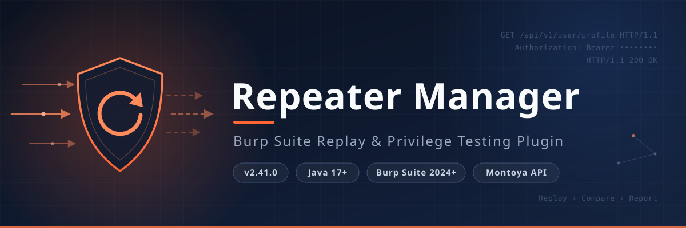

# Repeater Manager - Burp Suite Repeater Manager Plugin

<p align="center">
  
</p>

<p align="center">
  <strong>Advanced HTTP request replay management and privilege escalation testing plugin for Burp Suite, designed for security testers</strong>
</p>

<p align="center">
  English | <a href="./README.md">中文</a>
</p>

---

## Introduction

Repeater Manager is an advanced HTTP request replay management plugin designed for Burp Suite Professional. Compared to the native Repeater, it provides more powerful features, including request categorization, automatic response history recording and comparison, SQLite local persistence, content deduplication storage, multi-condition advanced search, API rule extraction, automated privilege escalation testing, multiple format import/export (ERM encrypted archives / Postman Collection), and scheduled auto-save mechanism. This plugin is particularly suitable for security testers and penetration testing experts, effectively improving the efficiency and organization of HTTP/HTTPS request testing.

> **Current Version**: v2.45.1 | **Requirements**: Burp Suite Professional 2024+ (Montoya Extension API) + Java 17+

## Core Features

| Feature | Description |
|---------|-------------|
| Request Management | Organize and categorize HTTP requests with color marking and comments |
| History Tracking | Automatically record response history for each request, easy to compare results from different times |
| Data Persistence | All requests and history saved to SQLite database, surviving Burp Suite restarts |
| Content Deduplication | Pool architecture (string pool/header pool/body pool/file pool) with SHA-256 automatic deduplication |
| Advanced Search | Multi-condition composite filtering to quickly locate specific requests/responses |
| Column Display Control | Customizable table columns for better information density and readability |
| API Rule Extraction | Configurable API extraction rule engine, supporting 4 extraction sources × 4 extraction methods, auto-extracting API paths from irregular requests |
| Privilege Testing | Automated privilege escalation vulnerability testing framework with user session token replacement and response comparison |
| User Info Management | End-to-end UserInfo management (role/username/anonymous flag/privilege proof screenshots), exported with reports |
| Scheme Management | Multi-scheme field management with scheme-session association and global persistence |
| Rule Group Judgment | Single active rule group + AND/OR mixed-logic multi-condition judgment, replacing legacy priority iteration mode |
| Judgment Rule Persistence | Rules support cross-session persistence flag, stored in global YAML, auto-restored on plugin startup |
| Anonymous User Creation | One-click guest user creation with all empty field values, intelligent scheme matching |
| Dedup Configuration | Priority-chain API deduplication with 6 strategies and 3 keep policies |
| Session Parsing | Auto-parse user sessions from clipboard, supporting Chrome DevTools fetch format |
| Test Info Configuration | Configure test target metadata (name/entry/screenshots/time range/personnel/custom report title), exported with reports |
| Data Import/Export | Support ERM encrypted archives (AES-256-CBC + HMAC-SHA256), Postman Collection v2.1, and more formats |
| Auto-save | Periodic synchronization of in-memory data to disk, preventing data loss |
| Garbage Collection | Background automatic cleanup of zero-reference pool data, reclaiming storage space (10min interval), toolbar toggle for auto/manual mode |
| Logging System | Multi-channel log output (Burp console/rolling file/UI panel) with level filtering (DEBUG/INFO/SUCCESS/WARN/ERROR) |
| Proxy Debugging | Support HTTP proxy configuration for request debugging |
| Layout Switching | Request/Response panel supports horizontal/vertical/request-only/response-only layouts |
| Message Comparison | String- and byte-level diff comparison for request/response pairs with syntax highlighting, synchronized scrolling, and diff navigation |
| Report Generation | Export privilege test results as PDF/HTML/Markdown reports with embedded request/response details, cURL/Postman code snippets, user info screenshots, image lightbox carousel, and privilege test case references |
| Batch Operations | Multi-select support in history panel; batch replay, batch privilege testing, batch delete |
| Clear Messages | One-click clearing of all baseline requests and replay history in request list panel, with linked database cleanup |
| Internationalization | Real-time zh_CN / en_US interface switching with persisted language preference and runtime dynamic updates |
| Comparer Panel | Dedicated Comparer tab, a Burp Comparer-like dual-list message comparison tool with words/bytes modes and multiple similarity algorithms |
| Built-in Tutorials | Built-in tutorial tab rendering quick start / detailed tutorials via CommonMark, with language switching linked to the global locale |
| About Panel | Displays project version, author, license, and GitHub link |

## Feature Architecture

```
Repeater Manager
├── Plugin Integration (Montoya SDK)
├── UI Organization (8 top-level tabs)
│   ├── Request Management (request list + edit/replay + history)
│   ├── Message Comparison (dedicated Comparer panel)
│   ├── Privilege Testing (session/judgment/scope/dedup/test info/report export)
│   ├── Data Management (ERM / Postman import-export)
│   ├── Configuration (storage/logging/proxy debug/API rules)
│   ├── Logging
│   ├── Tutorials (language switching, CommonMark rendering)
│   └── About
├── Request Management
│   ├── Request List (search/filter/color marking/comments)
│   ├── Request Editing (syntax highlighting)
│   └── Request Replay (async sending/timeout control)
├── Response Management
│   ├── Response Display (syntax highlighting)
│   └── Layout Switching (horizontal/vertical/request-only/response-only)
├── History Tracking
│   ├── Successful/Failed Request Recording
│   ├── History Replay
│   ├── Message Comparison (New)
│   │   ├── String/Byte-level diff comparison
│   │   ├── Diff navigation with synchronized scrolling
│   │   └── Collapsible search bar
│   └── Advanced Search (multi-condition filtering)
├── Comparer Panel
│   ├── Dual-list message collection and selection
│   ├── Words/Bytes comparison modes
│   ├── AUTO/LEVENSHTEIN/JACCARD/JSON/XML similarity algorithms
│   ├── Text/Hex display switching with synchronized scrolling
│   └── Diff navigation and fullscreen mode
├── Internationalization (I18nManager)
│   ├── Chinese (zh_CN) / English (en_US) resource bundles
│   ├── Runtime dynamic switching with persistence
│   └── Listener mechanism refreshing the whole UI
├── API Extraction Engine
│   ├── Sources: URL_PATH / URL_QUERY / HEADER / BODY
│   ├── Methods: REGEX / SUBSTR / JSON_PATH / XPATH
│   ├── Global Rules (YAML shared configuration)
│   └── Project Rules (SQLite independent storage)
├── Privilege Testing Module
│   ├── Multi-user Session Management
│   ├── User Info Management (UserInfo: role/username/anonymous flag/privilege proof screenshots)
│   ├── Scheme Management (scheme-field-session 3-tier architecture)
│   ├── Field Configuration (Header/JSON Body/XML Body/Form Field/Multipart Field/URL Param)
│   ├── Automated Field Replacement Engine
│   ├── Judgment Rule Group Configuration (single active rule set + AND/OR mixed-logic multi-condition)
│   ├── Judgment Rule Cross-session Persistence (global YAML, auto-restore on startup)
│   ├── One-click Anonymous User Creation
│   ├── Dedup Configuration (6 strategies × 3 keep policies priority-chain matching)
│   ├── Session Parsing (raw HTTP / Chrome fetch format)
│   ├── Automated Testing Engine (intercept proxy traffic → replay → judge)
│   ├── Test Info Configuration (target/entry/screenshots/time range/personnel/custom report title)
│   ├── Result Display with Color Coding
│   └── Report Generation
│       ├── PDF Report (Apache PDFBox)
│       ├── HTML Report (FreeMarker template, image lightbox carousel + privilege test case references)
│       └── Markdown Report (FreeMarker template)
├── Data Persistence
│   ├── SQLite Storage (custom connection pool)
│   ├── Content Splitting (Pool deduplication architecture)
│   ├── File Storage (large body externalization)
│   └── SHA-256 Hash Verification
├── Import/Export
│   ├── ERM Archive (AES-256-CBC + HMAC-SHA256 encryption)
│   ├── Postman Collection v2.1
│   └── Smart Format Detection
├── Background Services
│   ├── Auto-save Service
│   ├── Garbage Collection Service
│   └── History Recording Service (async queue)
├── Logging System
│   ├── Burp Console Output
│   ├── Rolling File Log
│   └── UI Log Panel
└── Configuration Management
    ├── Storage Config (auto/specified directory/specified file)
    ├── Logging Config (level/channel toggles)
    ├── Proxy Config
    └── API Rule Config (global + project-level)
```

## Installation

### Prerequisites

- Burp Suite Professional 2024.1 or higher
- Java 17 or higher

### Installation Steps

1. Download the latest JAR file from the [Releases](../../releases) page
2. Open Burp Suite Professional
3. Navigate to `Extensions` → `Installed` tab
4. Click the `Add` button
5. Select the downloaded JAR file in `Extension file`
6. Click `Next` to complete installation

> After the first load, the plugin automatically creates a session directory under `~/.burp/` (named with a timestamp), containing the database file, body data directory, and log directory. Global rules and configuration are stored in 5 YAML files under `~/.burp/repeater_manager/`: `api_extraction_rules.yaml` (API extraction rules), `judgment_rules.yaml` (judgment rules), `dedup_configs.yaml` (dedup configurations), `field_definitions.yaml` (field definitions), and `schemes.yaml` (schemes), shared across sessions.

## Quick Start

### Basic Usage

1. Right-click on any request in Burp Suite (e.g., Proxy, Intruder)
2. Select **"Send to Repeater Manager"**
3. Switch to the **"Repeater Manager"** tab to view and manage the request
4. Edit the request content and click **"Send"** to replay
5. View each replay's response in the history panel at the bottom left

### API Rule Extraction

1. Navigate to **"Configuration"** → **"API Rule Config"** tab
2. Add global rules (shared) or project rules (independent), configure extraction source and method
3. Use right-click menu or auto-trigger to extract standardized API paths from irregular requests
4. View and manage extraction results in the request list

### Interface & Layout

- The main interface contains 8 top-level tabs: Request Management / Message Comparison / Privilege Testing / Data Management / Configuration / Logging / Tutorials / About
- Switch **layout modes** (left-right / top-bottom / request-only / response-only) to suit different work scenarios
- Customize the displayed columns of the request list via **column control**
- Switch between Chinese and English interfaces in real time via **language switching** (preference auto-persisted)

### Data Management

- All data is automatically saved to SQLite database and survives restarts
- Adjust storage mode, log level, and auto-save interval via the **configuration panel**
- Import/export data using **ERM archives** or **Postman Collections**

### Advanced Features

- **API Rule Extraction**: Configure extraction rules to automatically extract standardized API paths from irregular requests
- **Privilege Testing**: Configure multi-user sessions and judgment rules to automatically detect horizontal/vertical privilege escalation vulnerabilities

For detailed usage instructions, please refer to:
- [Quick Start Tutorial](doc/tutorials/usage_quick_en.md)

## Technical Architecture

```
+---------------------+
|      UI Layer       |  Java Swing + RSyntaxTextArea
+---------------------+
|   Service Layer     |  AutoSave / GC / HistoryRecording / ApiExtraction / PrivilegeTest
+---------------------+
|   Data Access Layer |  RequestDAO / HistoryDAO / PoolManager / ApiExtractionRuleDAO
+---------------------+
|   Data Storage      |  SQLite + File Blobs (Pool Dedup) + YAML (Global Rules)
+---------------------+
```

**Core Tech Stack**:

- **Burp Integration**: Montoya SDK (`burp.api.montoya.*`) v2025.12 — modern Burp Suite extension interface
- **Frontend**: Java Swing + RSyntaxTextArea syntax highlighting component (v3.3.3)
- **Data Storage**: SQLite (JDBC v3.42.0.0) + custom connection pool (BlockingQueue + JDK Proxy)
- **Serialization**: Gson (v2.10.1) + SnakeYAML (v2.2)
- **Report Generation**: Apache PDFBox (v3.0.1) + FreeMarker (v2.3.33)
- **Documentation Rendering**: CommonMark (v0.22.0) — usage tutorial Markdown-to-HTML
- **Core Patterns**: MVC architecture, Singleton pattern, connection pool proxy pattern, Pool deduplication pattern, rule engine pattern

## Project Structure

```
src/main/java/
├── org/oxff/repeater/
│   ├── RepeaterManagerExtension.java    # Plugin lifecycle entry point (Montoya BurpExtension)
    ├── api/                            # API extraction subsystem
    │   ├── MontoyaApiHolder.java       # MontoyaApi static holder
    │   ├── ApiExtractionEngine.java    # Stateless rule-based extraction engine
    │   ├── ApiExtractionRule.java      # Extraction rule model
    │   ├── ApiExtractionRuleDAO.java   # Project-level rule CRUD (SQLite)
    │   ├── ApiRuleManager.java         # Project-level rule manager
    │   ├── GlobalRuleManager.java      # Global rule manager (YAML)
    │   ├── ApiRuleYamlIO.java          # Rule YAML serialization
    │   ├── ApiRuleSource.java          # Enum: URL_PATH/URL_QUERY/HEADER/BODY
    │   └── ApiRuleMethod.java          # Enum: REGEX/SUBSTR/JSON_PATH/XPATH
    ├── config/
    │   ├── DatabaseConfig.java         # Database config (storage mode/logging/proxy/language preference)
    │   └── SessionDirectory.java       # Session directory management
    ├── i18n/
    │   └── I18nManager.java            # Internationalization manager (zh_CN/en_US bundles, dynamic switching & persistence)
    ├── controller/
    │   └── PopMenu.java               # Context menu (ContextMenuItemsProvider)
    ├── db/
    │   ├── DatabaseManager.java        # Database connection management (pool/schema)
    │   ├── RequestDAO.java             # Request data access object
    │   ├── schema/                     # Schema management
    │   │   ├── SchemaInitializer.java  # Schema creation
    │   │   └── SchemaMigrator.java     # Schema versioning & migration
    │   ├── history/                    # History DAOs (read/write/update separation)
    │   │   ├── HistoryReadDAO.java     # History read operations
    │   │   ├── HistoryWriteDAO.java    # History write operations
    │   │   └── HistoryUpdateDAO.java   # History update operations
    │   └── pool/
    │       ├── PoolManager.java        # Pool deduplication manager
    │       ├── BodyStorageRoute.java   # Body storage routing (inline/file)
    │       ├── ContentHasher.java      # Content hash calculation (SHA-256)
    │       ├── ContentSplitter.java    # Request/Response content splitting
    │       ├── ContentReconstructor.java # Content reconstruction
    │       ├── FileStorageManager.java # File-based body storage
    │       ├── HttpEnum.java           # HTTP enum types
    │       └── SplitResult.java        # Split result
    ├── http/
    │   ├── ProxyConfig.java            # HTTP proxy configuration (singleton)
    │   ├── RequestManager.java         # HTTP request management (Montoya API async)
    │   ├── HttpRequestHelper.java      # HTTP request parsing utilities (Montoya types)
    │   ├── RequestDataHelper.java      # Request data validation/repair utilities
    │   ├── HttpMessageParser.java      # HTTP message parser
    │   └── RequestResponseRecord.java  # Request-response record model
    ├── io/
    │   ├── DataExporter.java           # Export dispatcher
    │   ├── DataImporter.java           # Import dispatcher (smart format detection)
    │   ├── ErmArchiveWriter.java       # ERM archive export (AES-256 encryption)
    │   ├── ErmArchiveReader.java       # ERM archive import
    │   ├── ErmCryptoHelper.java        # ERM crypto helper (PBKDF2/AES-CBC/HMAC)
    │   ├── ErmFormatConstants.java     # ERM format constants
    │   ├── FormatDetector.java         # Automatic format detection
    │   ├── PostmanExporter.java        # Postman Collection v2.1 export
    │   └── PostmanImporter.java        # Postman Collection v2.1 import
    ├── logging/
    │   ├── LogManager.java             # Log manager (multi-channel/level filtering)
    │   ├── LogEntry.java               # Log entry
    │   ├── LogHandler.java             # Log handler base class
    │   ├── LogLevel.java               # Log level enum
    │   ├── BurpConsoleHandler.java     # Burp console log handler
    │   ├── RollingFileHandler.java     # Rolling file log handler
    │   └── UIHandler.java              # UI panel log handler
    ├── model/
    │   ├── HistoryRecord.java          # History record model
    │   ├── RequestRecord.java          # Request record model
    │   └── RequestResponseRecord.java  # Request-response record model
    ├── privilege/                      # Privilege escalation testing subsystem
    │   ├── AutoTestEngine.java         # Automated testing engine (intercept → replay → judge)
    │   ├── ReplayEngine.java           # Request replay engine
    │   ├── JudgmentEngine.java         # Response judgment engine (3-layer + empty body awareness)
    │   ├── FieldReplacementEngine.java # Field replacement engine (empty-value removal semantics + XXE protection)
    │   ├── SessionManager.java         # User session manager (with UserInfo/TestInfoConfig cache)
    │   ├── JudgmentRuleManager.java    # Judgment rule manager (single active rule group)
    │   ├── GlobalJudgmentRuleManager.java # Judgment rule global YAML persistence & restore
    │   ├── GlobalSchemeManager.java    # Global scheme manager (YAML persistence)
    │   ├── GlobalFieldDefinitionManager.java # Global field definition manager (YAML persistence)
    │   ├── ScopeManager.java           # Request scope manager
    │   ├── DedupConfigManager.java     # Dedup config manager (global YAML + session memory)
    │   ├── ApiDedupEngine.java         # API dedup engine (6 strategies × 3 keep policies)
    │   ├── FetchRequestParser.java     # Chrome fetch format parser
    │   ├── SimilarityEngine.java       # Content-aware similarity engine (JSON/XML/HTML/TEXT/BINARY routing)
    │   ├── JsonSimilarityCalculator.java / XmlSimilarityCalculator.java / JaccardSimilarityCalculator.java / LevenshteinCalculator.java # Similarity algorithm implementations
    │   ├── ContentTypeDetector.java    # Response content type detection
    │   ├── SyncHttpSender.java         # Sync HTTP sender (with retry)
    │   ├── ScreenshotEncoder.java      # Report screenshot read/scale/base64 encoding
    │   ├── SessionParserEngine.java / SessionParser.java # Clipboard session parsing
    │   ├── JudgmentRuleYamlIO.java / FieldDefinitionYamlIO.java / UserSessionYamlIO.java / SchemeYamlIO.java / DedupConfigYamlIO.java # YAML serialization
    │   ├── model/                      # Privilege test models
    │   │   ├── UserSession.java        # User session (credentials/tokens)
    │   │   ├── JudgmentRule.java       # Judgment rule
    │   │   ├── JudgmentResult.java     # Test result (PENDING/ESCALATED/NOT_ESCALATED/ERROR)
    │   │   ├── FieldDefinition.java    # Field definition
    │   │   ├── FieldType.java          # Enum: HEADER/JSON_BODY/XML_BODY/FORM_FIELD/MULTIPART_FIELD/URL_PARAM
    │   │   ├── RuleTarget.java         # Enum: STATUS_CODE/RESPONSE_HEADER/RESPONSE_BODY/RESPONSE_TIME/SIMILARITY
    │   │   ├── RuleMethod.java         # Enum: REGEX/CONTAINS/EQUALS/GREATER_THAN/LESS_THAN/NUMERIC_EQUALS/NOT_CONTAINS/NOT_EQUALS/LENGTH_DIFF
    │   │   ├── RuleCondition.java      # Rule condition model (target + method + expression + AND/OR operators + negate)
    │   │   ├── Scheme.java             # Scheme model
    │   │   ├── ScopeEntry.java         # Scope configuration
    │   │   ├── DedupStrategy.java      # Enum: PATH/API/JSON_BODY_FIELD/XML_BODY_FIELD/FORM_FIELD/URL_PARAM
    │   │   └── DedupKeepPolicy.java    # Enum: FIRST/LAST/MIDDLE
    │   ├── dao/
    │   │   ├── SessionDAO.java         # User session CRUD
    │   │   ├── JudgmentRuleDAO.java    # Judgment rule CRUD
    │   │   ├── UserInfoDAO.java        # User info CRUD (role/username/anonymous flag/screenshots)
    │   │   ├── TestInfoConfigDAO.java  # Test info config CRUD
    │   │   └── ScopeDAO.java           # Scope CRUD
    │   └── report/                      # Report generation subsystem
    │       ├── ReportGenerator.java     # Abstract report generator base (Template Method pattern)
    │       ├── PdfReportGenerator.java  # PDF report (Apache PDFBox)
    │       ├── HtmlReportGenerator.java # HTML report (FreeMarker)
    │       ├── MarkdownReportGenerator.java # Markdown report (FreeMarker)
    │       ├── ReportExporter.java      # Report export dispatcher (PDF/HTML/Markdown/ERMR)
    │       ├── ReportData.java          # Report data model
    │       ├── ReportContainerWriter.java # Report container serialization
    │       ├── ReportContainerReader.java # Report container deserialization
    │       ├── BodyRenderer.java        # Body content renderer
    │       ├── BinaryContentRenderer.java # Binary content renderer (hex/base64/image)
    │       ├── CurlBuilder.java         # cURL command builder
    │       ├── PostmanSnippetBuilder.java # Postman code snippet builder
    │       └── FreeMarkerConfig.java    # FreeMarker configuration
    ├── service/
    │   ├── AutoSaveService.java        # Auto-save service
    │   ├── GarbageCollectorService.java # Garbage collection service (Pool zero-ref cleanup)
    │   └── HistoryRecordingService.java # History recording service (async queue)
    ├── ui/
    │   ├── MainUI.java                 # Main UI
    │   ├── RequestListPanel.java       # Request list panel (search/filter/color/clear messages)
    │   ├── RequestPanel.java           # Request detail panel
    │   ├── RequestPanelSender.java     # Request send handler (Montoya API)
    │   ├── ResponsePanel.java          # Response panel
    │   ├── DataPanel.java              # Data management panel (ERM/Postman import-export)
    │   ├── LogPanel.java               # Log panel
    │   ├── StatusPanel.java            # Bottom status bar
    │   ├── UsageTutorialPanel.java     # Usage tutorial panel (CommonMark rendering, zh/en switching)
    │   ├── AboutPanel.java             # About panel (version/author/license)
    │   ├── SwitchButton.java           # Switch button component
    │   ├── comparer/
    │   │   └── ComparerPanel.java      # Message comparison panel (dual list, words/bytes modes, multi-algorithm)
    │   ├── editor/
    │   │   ├── BurpRequestPanel.java   # Montoya HttpRequestEditor wrapper
    │   │   ├── BurpResponsePanel.java  # Montoya HttpResponseEditor wrapper
    │   │   ├── HttpEditorPanel.java    # HTTP editor base panel
    │   │   ├── EnhancedRequestPanel.java  # Enhanced request panel
    │   │   ├── EnhancedResponsePanel.java # Enhanced response panel
    │   │   └── HttpViewerPanel.java    # HTTP viewer panel
    │   ├── viewer/
    │   │   ├── HttpViewer.java         # HTTP viewer
    │   │   ├── HttpViewerPanel.java    # HTTP viewer panel
    │   │   └── ViewMode.java           # View mode enum
    │   ├── config/
    │   │   ├── ConfigPanel.java        # Multi-tab config panel
    │   │   ├── StorageConfigTab.java   # Storage config tab
    │   │   ├── ApiRuleConfigTab.java   # API extraction rule config tab
    │   │   ├── ApiRuleEditDialog.java  # Rule editor dialog
    │   │   ├── ApiRuleTableModel.java  # Rule table model
    │   │   └── ApiReExtractWorker.java # Background rule re-extraction worker
    │   ├── history/                    # History UI + Message comparison
    │   │   ├── HistoryPanel.java       # History panel (search/filter/multi-select)
    │   │   ├── HistoryContextMenu.java # History context menu (batch ops, comparison)
    │   │   ├── HistoryTableRenderer.java # History table cell renderer
    │   │   ├── AdvancedSearchDialog.java # Advanced search dialog
    │   │   ├── ColumnControlDialog.java  # Column control dialog
    │   │   ├── ComparisonDialog.java   # Message comparison dialog (tab/four-pane layout)
    │   │   ├── DiffEngine.java         # Diff algorithm engine (LCS-based, char-level inline diff)
    │   │   ├── DiffPane.java           # Self-contained diff display panel (RSyntaxTextArea)
    │   │   ├── DiffNavigator.java      # Diff region navigator (prev/next change)
    │   │   ├── SearchBar.java          # Collapsible search bar for diff content
    │   │   └── SynchronizedScrollPanel.java # Synchronized scrolling for side-by-side comparison
    │   ├── layout/
    │   │   └── LayoutManager.java      # Layout manager
    │   └── privilege/                  # Privilege test UI (6 sub-tabs)
    │       ├── PrivilegeTestPanel.java # Privilege test main panel (session/judgment/scope/dedup/test info/report export)
    │       ├── SessionConfigTab.java   # User session config tab
    │       ├── UserSessionTab.java     # User session list tab
    │       ├── JudgmentRuleConfigTab.java # Judgment rule config tab
    │       ├── ScopeConfigTab.java     # Scope config tab
    │       ├── DedupConfigTab.java     # Dedup config tab
    │       ├── TestInfoConfigTab.java  # Test info config tab
    │       ├── ReplayConfigTab.java    # Replay config tab
    │       ├── FieldDefinitionTab.java # Field definition tab
    │       ├── SchemeTab.java          # Scheme management tab
    │       ├── UserSessionTableModel.java
    │       ├── JudgmentRuleTableModel.java
    │       ├── FieldDefinitionTableModel.java
    │       ├── SchemeTableModel.java   # Scheme table model
    │       ├── UserSessionEditDialog.java
    │       ├── JudgmentRuleEditDialog.java
    │       ├── FieldDefinitionEditDialog.java
    │       ├── DedupConfigEditDialog.java # Dedup config edit dialog
    │       ├── SchemeEditDialog.java   # Scheme edit dialog
    │       ├── SelectSchemeDialog.java # Scheme selection dialog (anonymous user smart matching)
    │       ├── UserInfoDetailDialog.java # User info detail dialog (role/screenshots)
    │       ├── DateTimeRangePickerDialog.java # Test time range picker dialog
    │       ├── ParseSessionFromClipboardDialog.java # Clipboard session parsing dialog
    │       ├── ParseSessionWorker.java # Session parsing background worker
    │       ├── FieldValueCellRenderer.java # Field value cell renderer
    │       └── ConditionRow.java       # Rule condition row component (AND/OR mixed logic)
    ├── RequestDispatchHandler.java     # Central request dispatch handler
    └── utils/
        ├── TextLineNumber.java         # Text line number utility
        └── FileChooserHelper.java      # Unified file chooser utility
```

## Dependencies

| Dependency | Version | Maven Coordinate | Description |
|------------|---------|-----------------|-------------|
| Montoya API | 2025.12 | `net.portswigger.burp.extensions:montoya-api` | Modern Burp Suite extension interface (provided scope) |
| RSyntaxTextArea | 3.3.3 | `com.fifesoft:rsyntaxtextarea` | Syntax highlighting editor component |
| SQLite JDBC | 3.42.0.0 | `org.xerial:sqlite-jdbc` | SQLite JDBC driver |
| Gson | 2.10.1 | `com.google.code.gson:gson` | JSON serialization/deserialization |
| SnakeYAML | 2.2 | `org.yaml:snakeyaml` | YAML serialization (API extraction, judgment rules, user sessions, field definitions) |
| Apache PDFBox | 3.0.1 | `org.apache.pdfbox:pdfbox` | Native PDF report generation with embedded Chinese fonts |
| FreeMarker | 2.3.33 | `org.freemarker:freemarker` | Template engine for HTML/Markdown report rendering |
| CommonMark | 0.22.0 | `org.commonmark:commonmark` | Markdown-to-HTML rendering for usage tutorial |

## Build

The project uses Maven for building:

```bash
# Using build scripts
./script/build.sh        # Linux/macOS
script\build.bat         # Windows

# Or using Maven directly
mvn clean package
```

Build artifacts:
- Development version: `target/repeater-manager-2.45.1.jar`
- Timestamped release version: `target/releases/repeater-manager-2.45.1-YYYYMMDD-HHMMSS.jar`

## Use Cases

1. **API Security Testing**: Continuously test the same API with different parameter combinations and save all test results
2. **API Path Organization**: Use the API extraction engine to automatically extract standardized API paths from numerous irregular requests
3. **Privilege Escalation Detection**: Configure multi-user sessions to automatically detect horizontal/vertical privilege escalation vulnerabilities
4. **Vulnerability Reproduction**: Record all requests and responses during vulnerability exploitation for later reproduction
5. **Security Assessment**: Organize API collections of large applications for systematic security testing
6. **Team Collaboration**: Share data and rules via ERM archives and global YAML rule files
7. **Penetration Testing Documentation**: Record key requests during penetration testing for report writing

## Data Persistence

### Storage Modes

| Mode | Description |
|------|-------------|
| Auto (default) | Automatically creates timestamp-named session directory under `~/.burp/` |
| Specified Directory | Creates timestamp-named session directory under the specified directory |
| Specified File | Uses the specified database file directly, no timestamp subdirectory |

### Session Directory Structure

```
~/.burp/
├── repeater_manager_config.properties     # Plugin configuration file
├── repeater_manager/
│   ├── api_extraction_rules.yaml          # Global API extraction rules (cross-session shared)
│   ├── judgment_rules.yaml                # Global judgment rules (cross-session persistence)
│   ├── dedup_configs.yaml                 # Global dedup configurations (cross-session shared)
│   ├── field_definitions.yaml             # Global field definitions (cross-session shared)
│   └── schemes.yaml                       # Global schemes (cross-session shared)
└── session_20240101_120000/               # Session directory (timestamp-named)
    ├── repeater_manager.sqlite3           # SQLite database file
    ├── blobs/                             # External body data directory
    └── logs/                              # Log file directory
```

### Pool Deduplication Architecture

The database uses a Pool architecture for content deduplication via SHA-256 hash + reference counting:

- **string_pool**: Deduplication of domain/path/query strings
- **header_pool**: Deduplication of HTTP request/response headers
- **body_pool**: Deduplication of small body data (inline storage, SQLite BLOB)
- **file_pool**: Deduplication of large body data (file external storage, blobs/ directory)
- **gc_queue**: Garbage collection queue, automatically cleans up zero-reference data

### API Extraction Rule Storage

- **Global Rules**: Stored in `~/.burp/repeater_manager/api_extraction_rules.yaml`, shared across sessions, using negative IDs
- **Project Rules**: Stored in session SQLite database's `api_extraction_rules` table, using positive IDs
- Rule priority: Global and project rules sorted by priority, first-match-wins strategy

## Roadmap

- [x] Message Comparison (added v2.15.0, enhanced v2.16.0)
- [x] Report Generation (added v2.10.0, PDF/HTML/Markdown)
- [x] Batch Operations (added v2.13.0)
- [ ] Add request sequence functionality for multi-step request workflows
- [ ] Add request templates for quickly creating similar requests
- [ ] Support more data formats for import/export
- [ ] Add cloud sync for team rule sharing

## Contributing

Issues and Pull Requests are welcome. Please ensure:

1. Code style is consistent with existing code (follow Java 17 conventions)
2. New features should include documentation
3. Use Montoya SDK API (do not use legacy Burp Extender API)
4. Run `mvn clean package` before submitting to ensure the build succeeds

## License

This project is licensed under the [Apache License 2.0](LICENSE).

## Security Disclaimer

This project is intended solely for legitimate security testing and research. See [SECURITY.md](SECURITY.md) for details.
