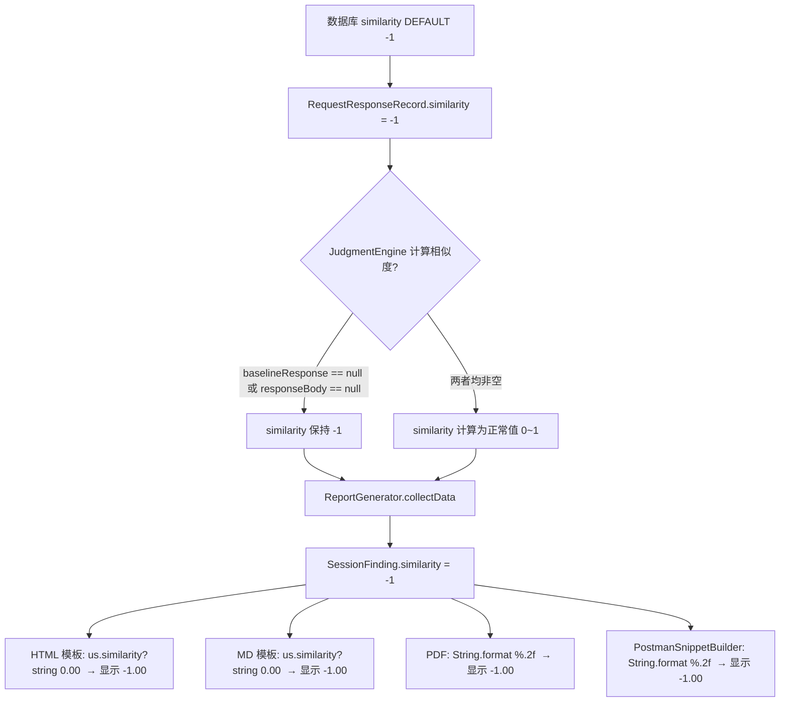

# 导出报告相似度为 -1 的问题分析报告

> 生成时间：2026-07-15  
> 分析人：Qoder AI  
> 严重程度：中等（影响报告可读性，不阻塞核心功能）

---

## 1. 问题现象

导出越权测试报告（HTML / Markdown / PDF）时，大量记录的相似度显示为 **`-1.00`**，例如：

- HTML 报告：`相似度: -1.00`
- Markdown 报告：`- **相似度**: -1.00`
- PDF 报告：`相似度: -1.00`

用户预期：相似度最低为 `0.00`（表示完全不相似），不存在负数。显示 `-1.00` 没有业务含义，会造成困惑。

---

## 2. 根因分析

### 2.1 设计层面的哨兵值

项目中将 `similarity = -1` 作为**哨兵值（Sentinel Value）**，表示"未计算"或"不适用"。该哨兵值在以下位置统一使用：

| 位置 | 代码 | 说明 |
|------|------|------|
| [JudgmentEngine.java](file:///d:/dev/java_dev/qoder/repeaterManger/src/main/java/org/oxff/repeater/privilege/JudgmentEngine.java#L102) | `double similarity = -1;` | 判决引擎中，相似度初始化为 -1 |
| [RequestResponseRecord.java](file:///d:/dev/java_dev/qoder/repeaterManger/src/main/java/org/oxff/repeater/http/RequestResponseRecord.java#L32) | `private double similarity = -1;` | 数据模型中默认值 -1 |
| [ReplayEngine.java](file:///d:/dev/java_dev/qoder/repeaterManger/src/main/java/org/oxff/repeater/privilege/ReplayEngine.java#L294) | `private double similarity = -1;` | 重放引擎内部判决封装 |
| [AutoTestEngine.java](file:///d:/dev/java_dev/qoder/repeaterManger/src/main/java/org/oxff/repeater/privilege/AutoTestEngine.java#L158) | `double similarity = -1;` | 自动测试引擎 |
| 数据库 Schema | `similarity REAL DEFAULT -1` | 数据库默认值 |

### 2.2 相似度保持 -1 的触发场景

下述场景中相似度不会被计算，保持哨兵值 `-1`：

1. **基准（Baseline）记录**：基准报文是其他会话的比较参照物，自身不参与相似度计算，其 `similarity` 始终为 `-1`
2. **响应体为空**（任一）：`JudgmentEngine.judge()` 第 103 行，`baselineResponse == null` 或 `responseBody == null` 时跳过相似度计算
3. **空 Body 判决路径**：触发 `judgeWithEmptyBody()` 时，走独立判决逻辑，不计算相似度
4. **网络错误/超时**：请求失败时无有效响应体，无法计算相似度
5. **旧数据兼容**：`ReportGenerator.collectData()` 第 67 行甚至将 `similarity == -1 && judgment == NOT_ESCALATED` 作为识别基准记录的启发式规则

### 2.3 报告层未过滤哨兵值（核心缺陷）

三份报告模板和一份 Postman 片段生成器直接输出原始 double 值，未对 `-1` 哨兵值做任何过滤：

#### HTML 模板（html_report.ftl 第 90 行）
```ftl
<div class="meta-info">相似度: ${us.similarity?string["0.00"]}</div>
```

#### Markdown 模板（md_report.ftl 第 58 行）
```ftl
- **相似度**: ${us.similarity?string["0.00"]}
```

#### PDF 生成器（PdfReportGenerator.java 第 290 行）
```java
meta.append("相似度: ").append(String.format("%.2f", session.getSimilarity()));
```

#### Postman 代码片段（PostmanSnippetBuilder.java 第 92 行）
```java
desc.append("- Similarity: ").append(String.format("%.2f", record.getSimilarity())).append("\n");
```

**四个输出渠道均直接使用原始 `double` 值格式化，导致 `-1.00` 原样暴露给用户。**

### 2.4 基准用户二次曝光问题

在 [ReportGenerator.java](file:///d:/dev/java_dev/qoder/repeaterManger/src/main/java/org/oxff/repeater/privilege/report/ReportGenerator.java#L128-L138) 第 128-138 行，基准用户也被包装为 `SessionFinding` 并加入报告。由于基准记录 `similarity = -1`，报告中会额外多出一条 `-1.00` 的条目。

### 2.5 数据流示意



---

## 3. 修复方案

### 3.1 核心策略

在 `ReportData.SessionFinding` 中新增 `getSimilarityDisplay()` 方法，统一处理哨兵值 → 友好文案的转换。报告模板/生成器统一调用该方法，不再直接访问原始 `double` 值。

**设计原则**：
- 哨兵值 `< 0` → 显示 `N/A`（不适用 / Not Applicable）
- 正常值 `[0, 1]` → 显示为百分比格式，如 `85.00%`
- 所有格式（HTML / MD / PDF / Postman）统一行为

### 3.2 具体修改点

#### 修改 1：ReportData.SessionFinding — 新增 `getSimilarityDisplay()` 方法

**文件**：[ReportData.java](file:///d:/dev/java_dev/qoder/repeaterManger/src/main/java/org/oxff/repeater/privilege/report/ReportData.java#L323-L329)

在 `SessionFinding` 类中新增两个方法：

```java
/**
 * 获取相似度的显示文本（用于报告输出）。
 * 哨兵值（< 0）返回 "N/A"，正常值返回百分比格式字符串。
 *
 * @return 显示文本，如 "85.23%" 或 "N/A"
 */
public String getSimilarityDisplay() {
    if (similarity < 0) {
        return "N/A";
    }
    return String.format("%.2f%%", similarity * 100);
}

/**
 * 获取相似度原始值是否为有效值（≥ 0 表示已计算）
 */
public boolean isSimilarityValid() {
    return similarity >= 0;
}
```

**理由**：
- `N/A` 是国际通用的"不适用"标记，语义清晰
- 百分比格式（`85.23%`）比小数（`0.85`）更直观
- 集中处理避免每个模板/生成器各自判断

#### 修改 2：HTML 模板 — 使用 `getSimilarityDisplay()`

**文件**：[html_report.ftl](file:///d:/dev/java_dev/qoder/repeaterManger/src/main/resources/templates/report/html_report.ftl#L90)

将：
```ftl
<div class="meta-info">相似度: ${us.similarity?string["0.00"]}</div>
```
改为：
```ftl
<div class="meta-info">相似度: ${us.similarityDisplay}</div>
```

#### 修改 3：Markdown 模板 — 使用 `getSimilarityDisplay()`

**文件**：[md_report.ftl](file:///d:/dev/java_dev/qoder/repeaterManger/src/main/resources/templates/report/md_report.ftl#L58)

将：
```ftl
- **相似度**: ${us.similarity?string["0.00"]}
```
改为：
```ftl
- **相似度**: ${us.similarityDisplay}
```

#### 修改 4：PDF 生成器 — 使用 `getSimilarityDisplay()`

**文件**：[PdfReportGenerator.java](file:///d:/dev/java_dev/qoder/repeaterManger/src/main/java/org/oxff/repeater/privilege/report/PdfReportGenerator.java#L290)

将：
```java
meta.append("相似度: ").append(String.format("%.2f", session.getSimilarity()));
```
改为：
```java
meta.append("相似度: ").append(session.getSimilarityDisplay());
```

#### 修改 5：Postman 代码片段生成器 — 使用 `getSimilarityDisplay()`

**文件**：[PostmanSnippetBuilder.java](file:///d:/dev/java_dev/qoder/repeaterManger/src/main/java/org/oxff/repeater/privilege/report/PostmanSnippetBuilder.java#L92)

将：
```java
desc.append("- Similarity: ").append(String.format("%.2f", record.getSimilarity())).append("\n");
```
改为：
```java
double sim = record.getSimilarity();
desc.append("- Similarity: ").append(sim >= 0 ? String.format("%.2f%%", sim * 100) : "N/A").append("\n");
```

> 注：PostmanSnippetBuilder 操作的是 `RequestResponseRecord` 而非 `SessionFinding`，因此需内联判断。

#### 修改 6（可选优化）：基准用户 SessionFinding 不再显示相似度

**文件**：[ReportGenerator.java](file:///d:/dev/java_dev/qoder/repeaterManger/src/main/java/org/oxff/repeater/privilege/report/ReportGenerator.java#L128-L138)

当前基准用户的 `SessionFinding` 已设置 `baseline = false`（第 134 行），这意味着报告模板将其作为普通会话渲染，会显示 `相似度: N/A`。考虑到"参考对照标准"区已有独立展示，建议将基准用户的 `SessionFinding` 设置 `baseline = true`，使其在报告统计中被正确排除的同时，在模板中也可以根据此标记跳过相似度行。

---

## 4. 影响评估

| 项目 | 说明 |
|------|------|
| **修改范围** | 5 个文件（1 数据模型 + 2 模板 + 1 PDF 生成器 + 1 Postman 生成器） |
| **破坏性变更** | 无。仅新增方法，不改变现有字段、枚举、数据库 Schema |
| **向后兼容** | 完全兼容。现有 DB 数据、API、判决逻辑均不受影响 |
| **测试要求** | 生成三种格式报告，验证 `-1` 场景显示 "N/A"，正常值显示百分比 |
| **风险评估** | 低。纯展示层改动 |

---

## 5. 验证清单

- [ ] 基准用户（similarity = -1）在 HTML 报告中显示 `相似度: N/A`
- [ ] 正常越权测试（similarity = 0.8523）在 HTML 报告中显示 `相似度: 85.23%`
- [ ] Markdown 报告同上
- [ ] PDF 报告同上
- [ ] Postman 代码片段同上
- [ ] 历史数据兼容：旧版本存储的 `similarity = -1` 记录正常显示 `N/A`
- [ ] `mvn compile` 编译通过
- [ ] 不影响越权判决引擎的相似度计算逻辑
