# Repeater Manager Burp Suite 插件 — 完整数据流分析

> 版本：v2.22.x | 生成日期：2026-06-21

本文档详细分析了 Repeater Manager 插件在不同业务操作中的完整数据流向，涵盖 MVC 架构、连接池、异步处理、Pool 去重、Montoya SDK 集成等技术原理，并使用 Mermaid 图表展示数据流。

---

## 目录

1. [总体架构概览](#1-总体架构概览)
2. [请求管理流程](#2-请求管理流程)
3. [API规则提取流程](#3-api规则提取流程)
4. [越权测试流程](#4-越权测试流程)
5. [历史记录流程](#5-历史记录流程)
6. [数据导入导出流程](#6-数据导入导出流程)
7. [架构模式与技术原理](#7-架构模式与技术原理)
8. [数据库存储结构](#8-数据库存储结构)

---

## 1. 总体架构概览

Repeater Manager 采用 MVC 架构，基于 Burp Suite Montoya SDK 构建，以 SQLite 为持久化后端。

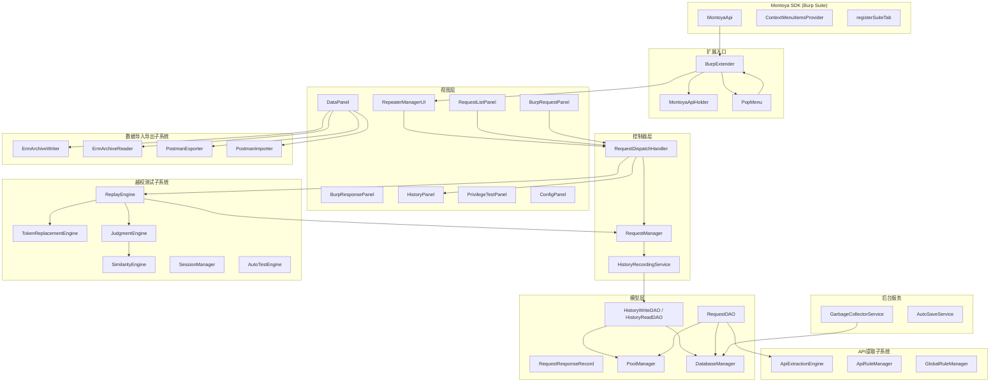

### 1.1 初始化顺序

```mermaid
graph LR
    A["MontoyaApi.initialize()"] --> B["MontoyaApiHolder.setApi()"]
    B --> C["LogManager.initialize()"]
    C --> D["DatabaseManager.initialize()"]
    D --> E["SchemaInitializer + SchemaMigrator"]
    E --> F["GC + AutoSave 启动"]
    F --> G["GlobalRuleManager.loadRules()"]
    G --> H["GlobalTokenLocationManager.loadLocations()"]
    H --> I["RepeaterManagerUI 构造"]
    I --> J["registerSuiteTab"]
    J --> K["registerContextMenuItemsProvider"]
```

---

## 2. 请求管理流程

### 2.1 请求接收与保存（右键菜单入口）

用户在 Burp Suite 的 Proxy History / HTTP History 等模块中选中请求，右键点击"发送到 Repeater Manager"，触发以下数据流：

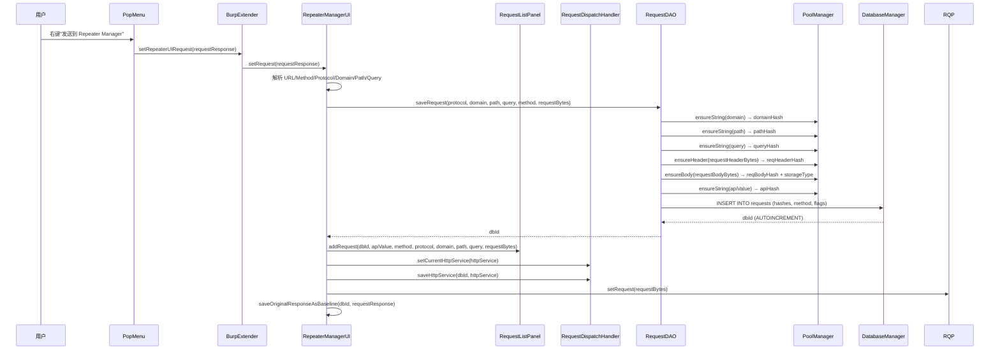

**关键数据转换点**：
- `HttpRequestResponse` → `byte[] requestBytes`：Montoya SDK 对象转为原始字节数组
- `httpRequest.url()` → `protocol/domain/path/query`：URL 解析拆分
- `HttpRequestHelper.resolveDomainWithPort()`：保留非标准端口（如 `127.0.0.1:9527`）
- `ApiExtractionEngine.extractApi()` → `apiValue`：API 规则引擎提取标准化 API 路径
- `RequestDAO.saveRequest()` → `dbId`：Pool 去重存储 + 数据库自增 ID

### 2.2 请求编辑与发送

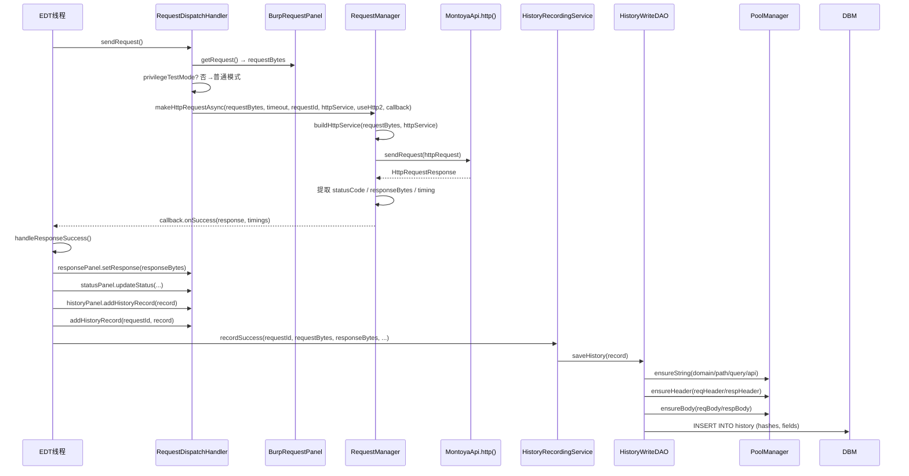

**异步关键点**：
- `RequestManager.makeHttpRequestAsync()` 在 `CachedThreadPool` 中执行 HTTP 发送
- 响应回调通过 `SwingUtilities.invokeLater()` 回到 EDT 线程更新 UI
- 历史记录通过 `HistoryRecordingService` 异步队列化保存，不阻塞 EDT

### 2.3 请求管理完整数据流总览

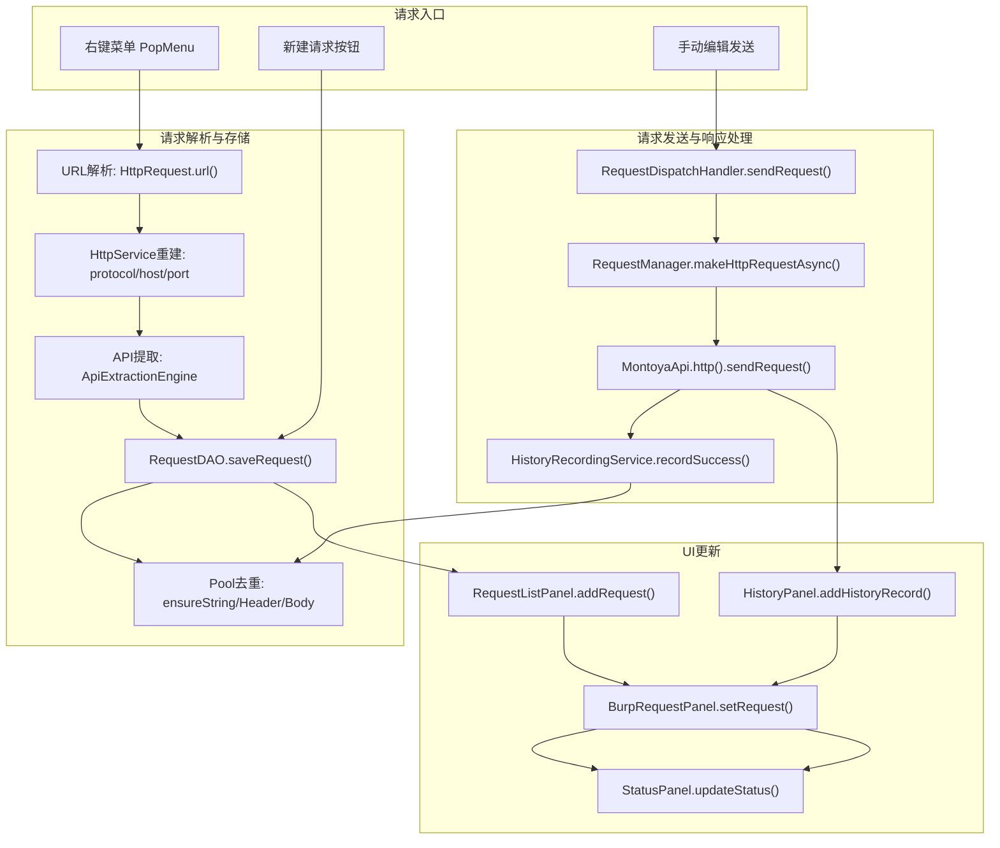

---

## 3. API规则提取流程

### 3.1 API提取引擎架构（4源 × 4方法）

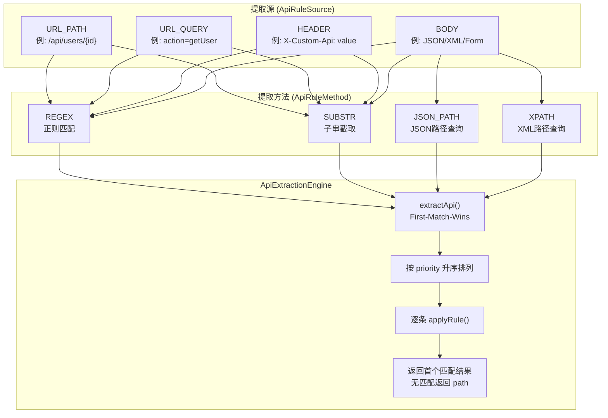

**提取源与方法组合矩阵**：

| 提取源 | REGEX | SUBSTR | JSON_PATH | XPATH |
|--------|-------|--------|-----------|-------|
| URL_PATH | ✓ | ✓ | ✗ | ✗ |
| URL_QUERY | ✓ | ✓ | ✗ | ✗ |
| HEADER | ✓ | ✓ | ✗ | ✗ |
| BODY | ✓ | ✓ | ✓ | ✓ |

### 3.2 API提取数据流

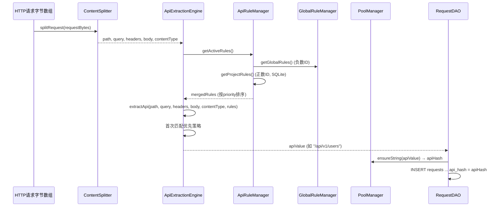

### 3.3 规则双层存储架构

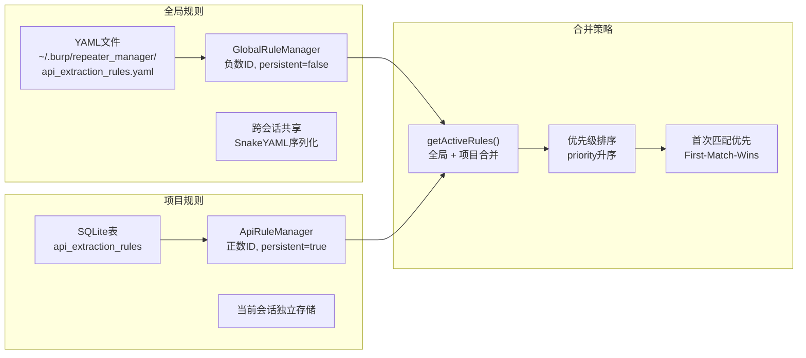

---

## 4. 越权测试流程

### 4.1 越权测试整体数据流

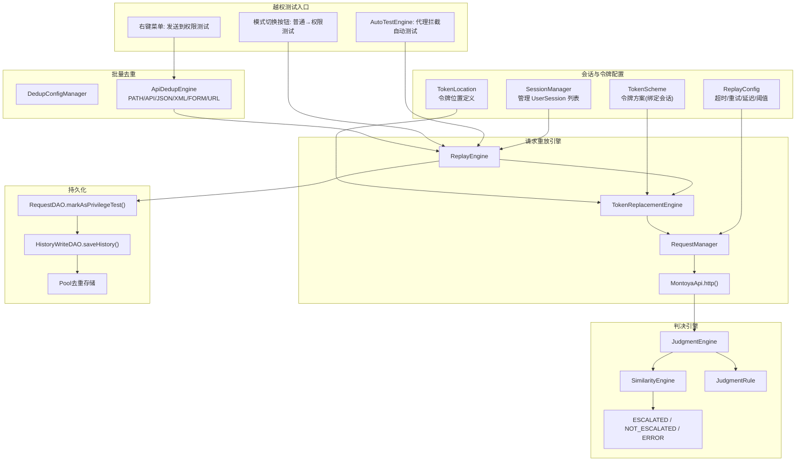

### 4.2 单条越权测试流程

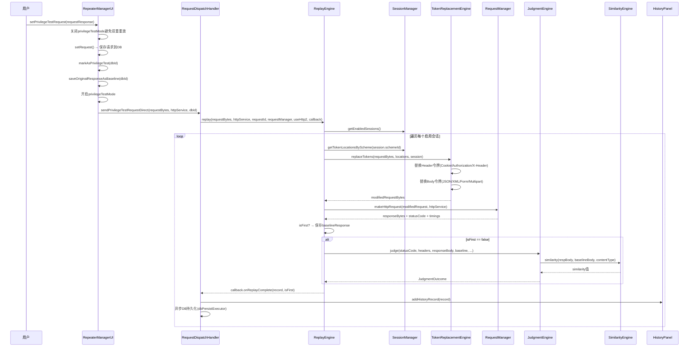

**EDT竞态修复**：`sendPrivilegeTestRequestDirect()` 使用参数化方法直接传递 `capturedRequestBytes/capturedHttpService/capturedRequestId`，避免依赖 volatile 共享状态 `currentRequestId`（它可能被后续调用覆盖）。

**批量越权测试概率性失败修复（3处根因）**：

1. **`sendSyncOnce` 超时不触发重试**：原代码 `sendSyncOnce` 的 wait/notify 超时后，`holder.errorMessage` 为 null，而 `sendSyncWithRetry` 的重试条件是 `holder.errorMessage != null`，导致超时的请求永不重试。修复：超时后显式设置 `holder.errorMessage = "请求超时"`，使重试逻辑能被触发（即使 `retryCount=0`，也能正确标记为 ERROR 并记录超时原因）。

2. **`makeHttpRequestAsync` 异步路径无超时控制**：原代码异步路径中 `timeoutSeconds` 参数被完全忽略，`api.http().sendRequest()` 同步阻塞调用无超时。修复：用独立线程执行 `sendRequest`，主线程用 `join(sendTimeoutMs)` 等待，超时后 `interrupt()` 中断发送线程并回调 `onFailure`，确保批量场景下不累积无限阻塞的超时线程。

3. **`ReplayEngine.useHttp2` 实例字段竞态**：原代码 `useHttp2` 是单例的 volatile 实例字段，在 `replay()` 开头被覆盖。批量重放期间 `setPrivilegeTestMode(true)` 注册了代理监听器，若此时有代理流量触发 `AutoTestEngine`，两个 `replay()` 调用并发，`this.useHttp2` 会被覆盖，导致 HTTP/2 请求降级为 HTTP/1.1 或反之。修复：将 `useHttp2` 改为方法参数传递（`finalUseHttp2`），彻底消除实例字段竞态。

4. **`latch.await()` 无超时**：批量重放中 `onAllComplete` 通过 `SwingUtilities.invokeLater` 在 EDT 上执行 `latch.countDown()`。批量100+请求时 EDT 队列积压大量 `onReplayComplete` 任务，`onAllComplete` 排在队尾延迟执行，导致 `batch-privilege-test` 线程无限阻塞。修复：`latch.await(timeout)` 添加基于会话数和请求超时的动态超时，超时后跳过当前请求继续下一条。

### 4.3 Token替换数据流

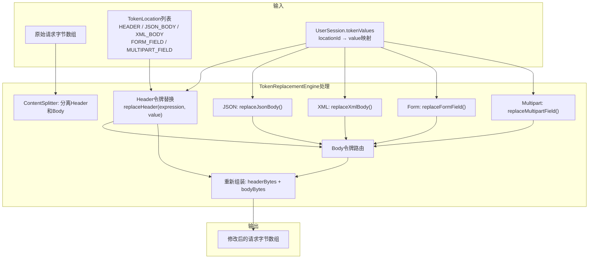

**Token替换类型路由**：
- **Header替换**：匹配 `expression`（如 `Cookie`、`Authorization`），替换整个值
- **JSON_BODY**：仅在 Content-Type 包含 `application/json` 时生效
- **XML_BODY**：仅在 Content-Type 包含 `xml` 时生效
- **FORM_FIELD**：仅在 Content-Type 包含 `x-www-form-urlencoded` 时生效
- **MULTIPART_FIELD**：仅在 Content-Type 包含 `multipart/form-data` 时生效

### 4.4 相似度计算路由策略

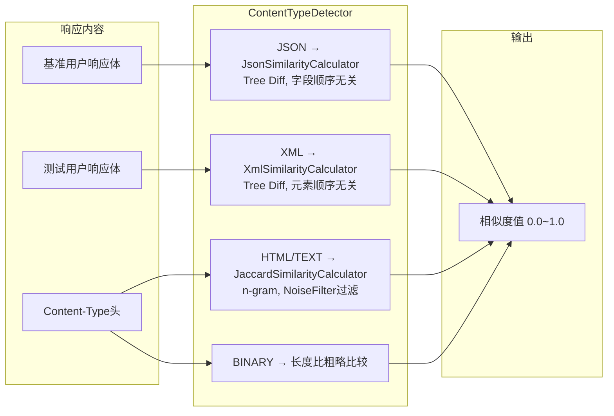

### 4.5 AutoTestEngine 代理拦截自动测试

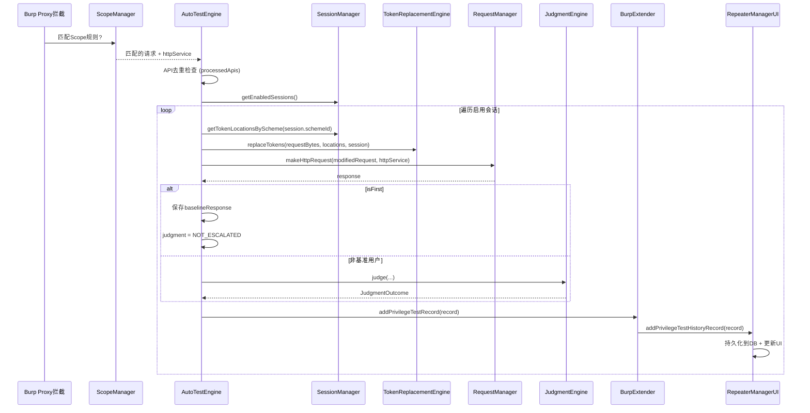

---

## 5. 历史记录流程

### 5.1 异步队列化保存架构

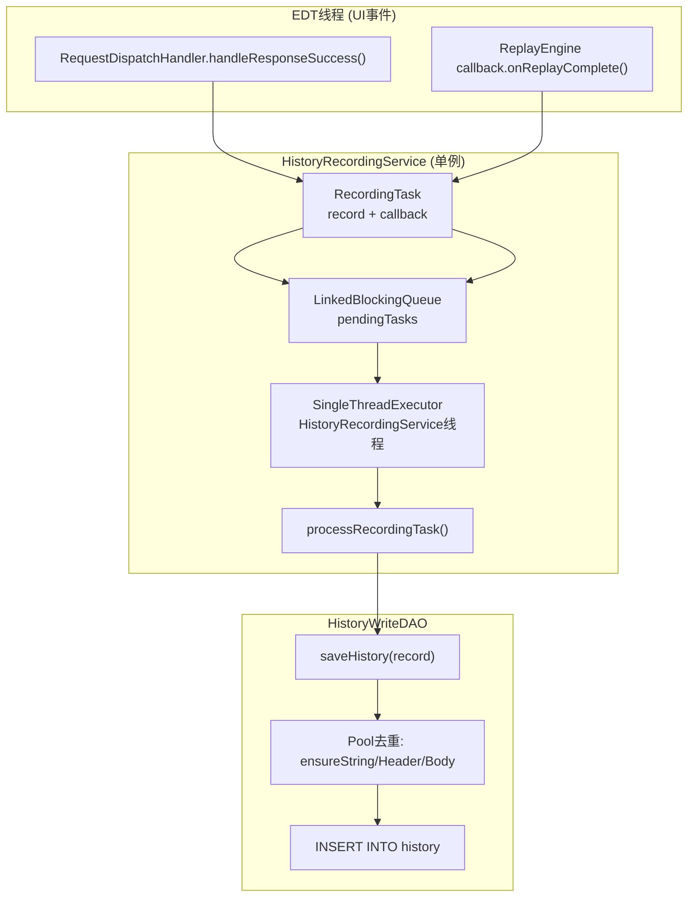

### 5.2 历史记录保存详细流程

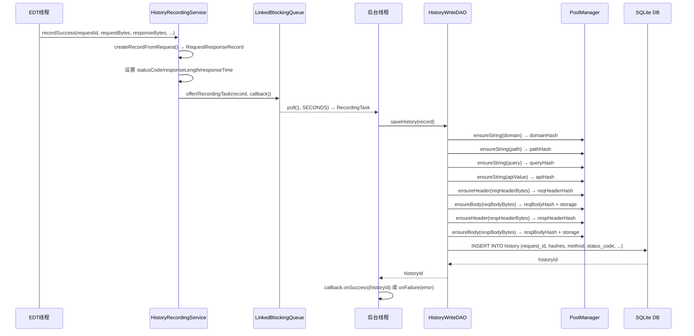

### 5.3 历史记录读取与展示

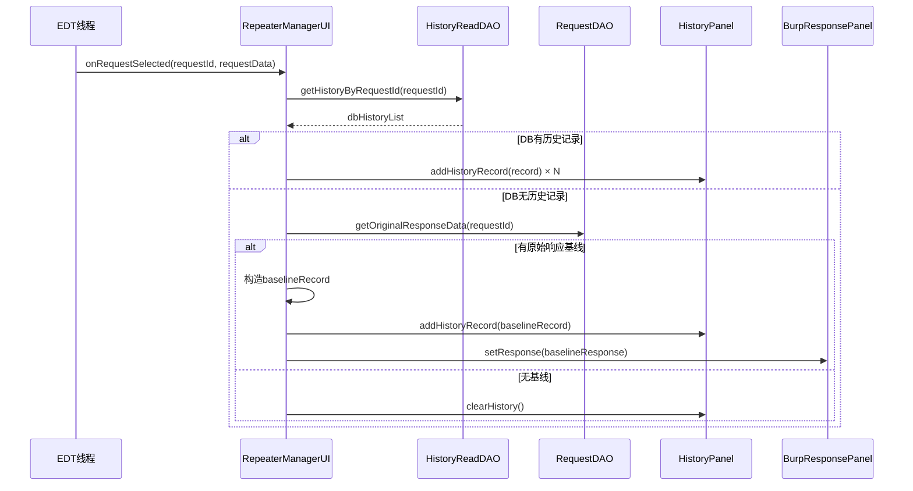

### 5.4 垃圾回收流程

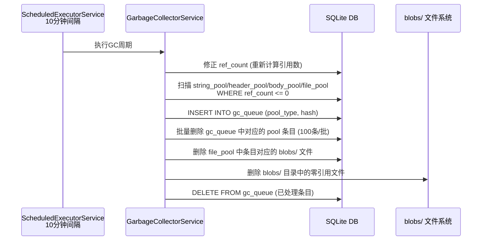

**GC暂停机制**：批量操作期间调用 `gcService.pause()` 暂停GC，避免与高并发DB写操作竞争连接池；操作完成后调用 `gcService.resume()` 恢复。

---

## 6. 数据导入导出流程

### 6.1 ERM存档导出流程

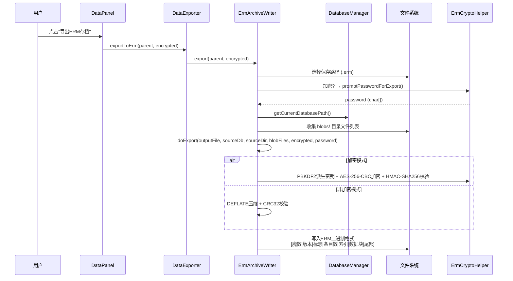

**ERM存档格式**：自定义二进制格式，魔数头 `0x89 0x45 0x52 0x4D`（4字节，首字节 `0x89` 借鉴 PNG 格式检测 7-bit 传输损坏），支持可选的 AES-256-CBC + HMAC-SHA256 加密，包含完整的 SQLite 数据库和 blobs/ 目录文件。

### 6.2 ERM存档导入流程

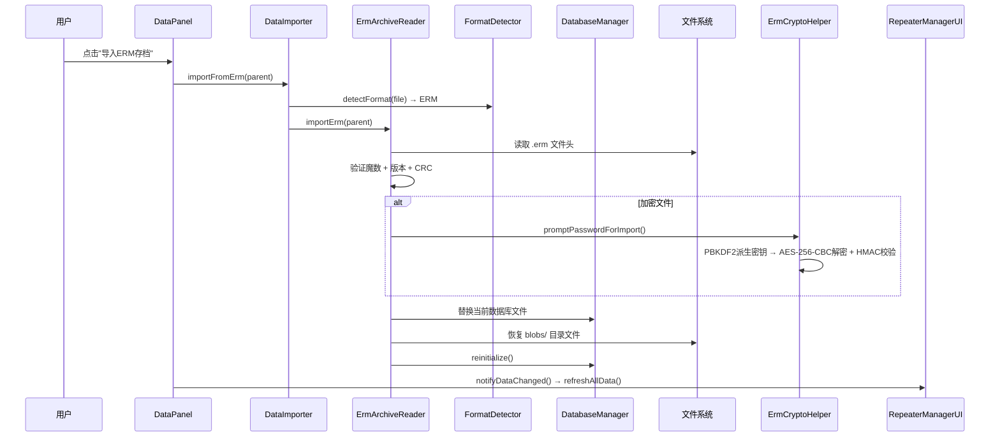

### 6.3 Postman导入导出流程

```mermaid
graph TB
    subgraph Export["Postman导出"]
        A1["DataPanel → DataExporter"]
        A2["PostmanExporter.export()"]
        A3["RequestDAO.getAllRequests()"]
        A4["构造 Collection v2.1 JSON"]
        A5["写入 .json 文件"]
    end

    subgraph Import["Postman导入"]
        B1["DataPanel → DataImporter"]
        B2["FormatDetector → POSTMAN_V21"]
        B3["PostmanImporter.importFromPostman()"]
        B4["解析 Collection v2.1 JSON"]
        B5["逐条 RequestDAO.saveRequest()"]
        B6["refreshAllData()"]
    end

    A1 --> A2 --> A3 --> A4 --> A5
    B1 --> B2 --> B3 --> B4 --> B5 --> B6
```

### 6.4 智能导入格式检测

```mermaid
graph LR
    A["输入文件"] --> B["FormatDetector.detectFormat()"]
    B --> C{扩展名判断}
    C -->|.erm| D["isErmFile()<br/>魔数 0x89 0x45 0x52 0x4D (4字节)"]
    C -->|.sqlite3/.db| E["isSQLiteFile()<br/>SQLite format 3"]
    C -->|.json| F["detectJsonFormat()"]
    D --> G["ImportFormat.ERM"]
    E --> H["ImportFormat.SQLITE3"]
    F --> I["ImportFormat.POSTMAN_V21"]
    F --> J["ImportFormat.UNKNOWN"]
```

---

## 7. 架构模式与技术原理

### 7.1 MVC架构数据传递

```mermaid
graph TB
    subgraph View["视图层 (Swing UI)"]
        V1["RepeaterManagerUI<br/>主容器/协调器"]
        V2["RequestListPanel<br/>请求列表表格"]
        V3["BurpRequestPanel<br/>Montoya HttpRequestEditor"]
        V4["BurpResponsePanel<br/>Montoya HttpResponseEditor"]
        V5["HistoryPanel<br/>历史记录表格"]
        V6["PrivilegeTestPanel<br/>会话/令牌配置"]
        V7["ConfigPanel<br/>存储/日志/代理设置"]
        V8["DataPanel<br/>导入导出操作"]
        V9["StatusPanel<br/>状态栏"]
    end

    subgraph Controller["控制器层"]
        C1["RequestDispatchHandler<br/>请求调度: 普通/越权模式路由"]
        C2["PopMenu<br/>右键菜单"]
        C3["LayoutManager<br/>编辑区布局切换"]
        C4["HistoryContextMenu<br/>历史记录右键操作"]
    end

    subgraph Model["模型层"]
        M1["RequestResponseRecord<br/>HTTP交互记录"]
        M2["RequestDAO / HistoryDAO<br/>数据访问对象"]
        M3["PoolManager<br/>SHA-256去重存储"]
        M4["DatabaseManager<br/>连接池+Schema"]
        M5["SessionManager<br/>会话/令牌缓存"]
        M6["ApiExtractionRule<br/>API提取规则"]
        M7["UserSession<br/>用户会话"]
        M8["TokenLocation<br/>令牌位置定义"]
    end

    V1 --> C1
    V2 --> C1
    V3 --> C1
    C1 --> M1
    C1 --> M2
    C1 --> M3
    V5 --> C4
    V6 --> M5 --> M7 --> M8
    V7 --> M4
    V8 --> M2
    C2 --> V1
```

**MVC数据传递规则**：
- **View → Controller**：UI事件通过回调/监听器传递（按钮点击、列表选择、右键菜单）
- **Controller → Model**：调用 DAO/Service 进行数据操作（保存、查询、删除）
- **Model → View**：通过 `SwingUtilities.invokeLater()` 回到 EDT 更新 UI
- **Controller跨层协调**：`RequestDispatchHandler` 同时持有 View 和 Model 引用

### 7.2 Pool去重架构工作原理

```mermaid
graph TB
    subgraph Input["HTTP请求/响应原始数据"]
        A1["domain: example.com"]
        A2["path: /api/v1/users"]
        A3["query: action=getUser&id=1"]
        A4["requestHeaders"]
        A5["requestBody"]
        A6["responseHeaders"]
        A7["responseBody"]
    end

    subgraph Hash["SHA-256哈希计算 (ContentHasher)"]
        H1["hashString() → 64字符hex"]
        H2["hashBytes() → 64字符hex"]
    end

    subgraph Pools["四个Pool表"]
        P1["string_pool<br/>hash(PK) | value(TEXT) | ref_count"]
        P2["header_pool<br/>hash(PK) | data(BLOB) | size | ref_count"]
        P3["body_pool<br/>hash(PK) | data(BLOB) | size | ref_count | is_binary"]
        P4["file_pool<br/>hash(PK) | relative_path | size | ref_count | is_binary"]
    end

    subgraph Route["存储路由 (BodyStorageRoute)"]
        R1["小Body (<64KB)且非二进制<br/>→ body_pool INLINE"]
        R2["大Body (>=64KB)或含null字节<br/>→ file_pool + blobs/目录"]
    end

    subgraph GC["垃圾回收"]
        G1["gc_queue"]
        G2["GarbageCollectorService<br/>10分钟间隔"]
        G3["删除 ref_count <= 0"]
        G4["删除 blobs/ 文件"]
    end

    A1 --> H1 --> P1
    A2 --> H1 --> P1
    A3 --> H1 --> P1
    A4 --> H2 --> P2
    A5 --> R1 --> R2 --> P3
    A5 --> R1 --> R2 --> P4
    A6 --> H2 --> P2
    A7 --> R1 --> R2 --> P3
    A7 --> R1 --> R2 --> P4
    P1 --> G1 --> G2 --> G3
    P2 --> G1
    P3 --> G1 --> G4
    P4 --> G1 --> G4
```

**Pool去重工作原理详解**：

1. **写入**：`PoolManager.ensureXxx(conn, value)` 执行 `INSERT ... ON CONFLICT(hash) DO UPDATE SET ref_count = ref_count + 1`（SQLite UPSERT 语法）
2. **读取**：`PoolManager.readString(conn, hash)` 优先查内存缓存（`ConcurrentHashMap`），未命中查 DB
3. **删除**：删除请求时调用 `releaseString/Header/Body()` 减少 `ref_count`，入队 `gc_queue`
4. **回收**：`GarbageCollectorService` 每10分钟扫描，删除零引用条目和对应的 blobs/ 文件
5. **缓存**：三层内存缓存（existenceCache 2000条 / stringCache 1000条 / headerCache 500条），超过阈值淘汰25%

### 7.3 SQLite连接池实现

```mermaid
graph TB
    subgraph Pool["连接池架构"]
        A1["ArrayBlockingQueue<br/>POOL_SIZE = 15"]
        A2["createNewConnection()<br/>PRAGMA: journal_mode=DELETE,<br/>synchronous=NORMAL,<br/>foreign_keys=ON,<br/>busy_timeout=5000"]
        A3["getConnection()<br/>poll(2, SECONDS)<br/>超时→创建新连接"]
    end

    subgraph Proxy["JDK动态代理"]
        B1["PooledConnectionInvocationHandler"]
        B2["拦截 close() → 归还到池<br/>setAutoCommit(true)"]
        B3["拦截 isClosed() → 返回代理状态"]
        B4["其他方法 → 委托给真实Connection"]
        B5["Proxy.newProxyInstance()"]
    end

    subgraph Usage["使用模式"]
        C1["try-with-resources<br/>conn.close() → 归还池中"]
        C2["无需手动returnConnection()"]
        C3["@Deprecated 标记旧方法"]
    end

    A1 --> A3 --> B1 --> B5 --> C1
    A2 --> A1
    B1 --> B2 --> B3 --> B4
```

**连接池关键技术点**：
- **获取连接**：`poll(2, SECONDS)` 从 `ArrayBlockingQueue` 取出，超时则 `createNewConnection()`
- **代理拦截**：`InvocationHandler` 拦截 `close()` → 重置 `autoCommit=true` → `offer()` 归还池
- **透明复用**：`try(conn = dbManager.getConnection()) { ... }` 无需修改，`close()` 自动归还
- **池满处理**：`offer()` 失败时真正关闭连接
- **初始化预填充**：数据库初始化时预创建15个连接填充池

### 7.4 异步处理机制

```mermaid
graph TB
    subgraph AsyncHTTP["HTTP请求异步发送"]
        A1["RequestDispatchHandler.sendRequest()"]
        A2["RequestManager.makeHttpRequestAsync()"]
        A3["CachedThreadPool<br/>RepeaterManager-RequestThread"]
        A4["MontoyaApi.http().sendRequest()"]
        A5["callback → SwingUtilities.invokeLater()"]
    end

    subgraph AsyncHistory["历史记录异步保存"]
        B1["HistoryRecordingService 单例"]
        B2["LinkedBlockingQueue"]
        B3["后台线程: poll(1, SECONDS)"]
        B4["HistoryWriteDAO.saveHistory()"]
        B5["callback.onSuccess/onFailure"]
    end

    subgraph AsyncPrivilege["越权测试异步"]
        C1["ReplayEngine 后台线程逐会话重放"]
        C2["sendSyncWithRetry()"]
        C3["callback → EDT invokeLater"]
        C4["dbPersistExecutor DB持久化"]
    end

    subgraph AsyncBatch["批量操作异步"]
        D1["setPrivilegeTestRequests()"]
        D2["后台Thread: batch-privilege-test-setup"]
        D3["批量DB保存 (后台)"]
        D4["批量UI更新 (EDT invokeLater)"]
    end

    subgraph AsyncGC["垃圾回收异步"]
        E1["ScheduledExecutorService<br/>2min延迟, 10min间隔"]
        E2["扫描 gc_queue"]
        E3["批量删除零引用 (100条/批)"]
    end

    A1 --> A2 --> A3 --> A4 --> A5
    B1 --> B2 --> B3 --> B4 --> B5
    C1 --> C2 --> C3 --> C4
    D1 --> D2 --> D3 --> D4
    E1 --> E2 --> E3
```

**异步处理核心原则**：
- **EDT不阻塞**：所有 DB 操作、HTTP 发送均卸载到后台线程
- **EDT回调**：后台结果通过 `SwingUtilities.invokeLater()` 回到 UI 线程
- **队列化缓冲**：`HistoryRecordingService` 使用 `LinkedBlockingQueue` 缓冲录制任务
- **连接池保护**：批量操作期间暂停 GC (`gcService.pause()`)，避免竞争连接池

### 7.5 Montoya SDK集成方式

```mermaid
graph TB
    subgraph Montoya["Montoya SDK (2025.12)"]
        M1["MontoyaApi<br/>Burp扩展主接口"]
        M2["BurpExtension<br/>initialize(MontoyaApi)"]
        M3["ContextMenuItemsProvider<br/>右键菜单注册"]
        M4["HttpRequest / HttpResponse<br/>工厂方法创建"]
        M5["HttpRequestEditor / HttpResponseEditor<br/>Burp内置编辑器"]
        M6["HttpService<br/>协议/主机/端口"]
        M7["ByteArray<br/>字节数组封装"]
    end

    subgraph Bridge["桥接层"]
        B1["MontoyaApiHolder<br/>静态持有MontoyaApi"]
        B2["BurpExtender<br/>实现BurpExtension"]
        B3["PopMenu<br/>实现ContextMenuItemsProvider"]
    end

    subgraph Usage["使用方式"]
        U1["BurpRequestPanel<br/>createHttpRequestEditor()"]
        U2["BurpResponsePanel<br/>createHttpResponseEditor()"]
        U3["RequestManager<br/>api.http().sendRequest()"]
        U4["ReplayEngine<br/>api.http().sendRequest()"]
        U5["AutoTestEngine<br/>api.http().sendRequest()"]
    end

    M1 --> B1 --> U1 --> U2 --> U3 --> U4 --> U5
    M2 --> B2
    M3 --> B3
    M4 --> U3
    M5 --> U1
    M6 --> U3
    M7 --> U4
```

**Montoya SDK集成关键决策**：
- 使用 `BurpExtension` 接口（非旧版 `IBurpExtender`）
- `MontoyaApiHolder` 静态持有者解决构造注入与静态访问兼容问题
- 编辑器使用 `createHttpRequestEditor/ResponseEditor` 获得 Burp 内置渲染能力
- HTTP 发送统一使用 `api.http().sendRequest()` 确保经过 Burp 代理
- 右键菜单通过 `ContextMenuItemsProvider` 注册，支持单条和批量操作

---

## 8. 数据库存储结构

### 8.1 完整Schema关系图

```mermaid
graph TB
    subgraph Core["核心业务表"]
        R["requests<br/>id | protocol | domain_hash | path_hash | query_hash |<br/>method | api_hash | is_privilege_test |<br/>req_header_hash | req_body_hash | req_body_storage |<br/>resp_header_hash | resp_body_hash | resp_body_storage |<br/>resp_status_code | resp_length | resp_time"]
        H["history<br/>id | request_id(FK) | method | protocol |<br/>domain_hash | path_hash | query_hash | status_code |<br/>req_header_hash | req_body_hash | req_body_storage |<br/>resp_header_hash | resp_body_hash | resp_body_storage |<br/>api_hash | user_session_name | judgment | similarity"]
    end

    subgraph Pools["去重Pool表"]
        SP["string_pool<br/>hash(PK) | value | ref_count"]
        HP["header_pool<br/>hash(PK) | data(BLOB) | size | ref_count"]
        BP["body_pool<br/>hash(PK) | data(BLOB) | size | ref_count | is_binary"]
        FP["file_pool<br/>hash(PK) | relative_path | size | ref_count | is_binary"]
    end

    subgraph GC["垃圾回收"]
        GCQ["gc_queue<br/>id | pool_type | hash"]
    end

    subgraph Privilege["越权测试相关表"]
        TL["token_locations<br/>id | type | expression | enabled"]
        TS["token_schemes<br/>id | name | enabled"]
        US["user_sessions<br/>id | name | color | scheme_id(FK)"]
        TV["token_values<br/>id | session_id(FK) | location_id(FK) | value"]
        RC["replay_config<br/>similarity_threshold | timeout | retry"]
        SCOPE["scope_rules<br/>id | host_pattern | path_pattern | auto_test"]
        JR["judgment_rules<br/>id | target | method | expression | priority"]
    end

    subgraph API["API提取规则表"]
        AER["api_extraction_rules<br/>id | source | method | expression | priority"]
    end

    subgraph Meta["元数据"]
        SM["schema_meta<br/>key(PK) | value<br/>schema_version=11"]
    end

    R --> SP
    R --> HP
    R --> BP
    R --> FP
    H --> SP
    H --> HP
    H --> BP
    H --> FP
    H --> R
    US --> TS
    TV --> US
    TV --> TL
    SP --> GCQ
    HP --> GCQ
    BP --> GCQ
    FP --> GCQ
```

### 8.2 数据库文件与目录结构

```mermaid
graph LR
    subgraph SessionDir["会话目录 ~/.burp/session_xxxx/"]
        DB["repeater_manager.db<br/>SQLite主数据库"]
        B["blobs/<br/>大Body外置文件<br/>SHA-256哈希命名"]
        L["logs/<br/>滚动式日志文件"]
    end

    subgraph GlobalDir["全局配置 ~/.burp/repeater_manager/"]
        Y1["api_extraction_rules.yaml"]
        Y2["token_locations.yaml"]
        Y3["dedup_configs.yaml"]
        Y4["judgment_rules.yaml"]
    end

    DB --> B
```

---

## 附录：关键类职责速查表

| 类名 | 文件路径 | 职责 | 关键技术 |
|------|----------|------|----------|
| BurpExtender | `burp/BurpExtender.java` | 扩展入口，初始化所有组件 | Montoya BurpExtension |
| MontoyaApiHolder | `oxff/top/api/MontoyaApiHolder.java` | MontoyaApi静态持有者 | 静态桥接模式 |
| RepeaterManagerUI | `oxff/top/RepeaterManagerUI.java` | 主UI容器，协调所有面板 | Swing JSplitPane/JTabbedPane |
| RequestDispatchHandler | `oxff/top/RequestDispatchHandler.java` | 请求调度核心，普通/越权模式路由 | volatile状态 + EDT竞态修复 |
| RequestManager | `oxff/top/http/RequestManager.java` | 异步HTTP请求发送 | CachedThreadPool + Montoya API |
| HistoryRecordingService | `oxff/top/service/HistoryRecordingService.java` | 异步队列化历史保存 | LinkedBlockingQueue + SingleThreadExecutor |
| DatabaseManager | `oxff/top/db/DatabaseManager.java` | SQLite连接池管理 | ArrayBlockingQueue + JDK Proxy |
| PoolManager | `oxff/top/db/pool/PoolManager.java` | SHA-256去重存储 | INSERT-OR-INCREMENT + ConcurrentHashMap缓存 |
| ContentSplitter | `oxff/top/db/pool/ContentSplitter.java` | HTTP报文头部/体分离 | 字节级拆分 |
| ContentReconstructor | `oxff/top/db/pool/ContentReconstructor.java` | 从Pool重建完整报文 | hash→data反向查询 |
| ContentHasher | `oxff/top/db/pool/ContentHasher.java` | SHA-256哈希计算 + 存储路由决策 | SHA-256 + 64KB阈值 + 二进制检测 |
| BodyStorageRoute | `oxff/top/db/pool/BodyStorageRoute.java` | Body存储路由(inline/file) | 大小阈值判断(64KB) + 二进制检测 |
| FileStorageManager | `oxff/top/db/pool/FileStorageManager.java` | blobs/目录文件读写 | SHA-256哈希命名 |
| GarbageCollectorService | `oxff/top/service/GarbageCollectorService.java` | 定期清理零引用数据 | ScheduledExecutorService + gc_queue |
| AutoSaveService | `oxff/top/service/AutoSaveService.java` | 定时数据库检查点 | ScheduledExecutorService |
| ReplayEngine | `oxff/top/privilege/ReplayEngine.java` | 越权测试重放引擎 | 多会话遍历 + 同步发送 + 重试 |
| TokenReplacementEngine | `oxff/top/privilege/TokenReplacementEngine.java` | 请求令牌替换 | Header/JSON/XML/Form/Multipart路由 |
| JudgmentEngine | `oxff/top/privilege/JudgmentEngine.java` | 响应越权判决 | 规则优先匹配 + 相似度回退 |
| SimilarityEngine | `oxff/top/privilege/SimilarityEngine.java` | 内容感知相似度 | JSON/XML/Jaccard/Binary路由 |
| AutoTestEngine | `oxff/top/privilege/AutoTestEngine.java` | 代理拦截自动测试 | Scope匹配 + API去重 |
| SessionManager | `oxff/top/privilege/SessionManager.java` | 会话/令牌/方案缓存 | DAO + 缓存列表 |
| ApiExtractionEngine | `oxff/top/api/ApiExtractionEngine.java` | API标识提取 | 4源×4方法 + First-Match-Wins |
| ApiRuleManager | `oxff/top/api/ApiRuleManager.java` | 项目级API规则管理 | SQLite持久化 |
| GlobalRuleManager | `oxff/top/api/GlobalRuleManager.java` | 全局API规则管理 | YAML文件 + 负数ID |
| ApiRuleYamlIO | `oxff/top/api/ApiRuleYamlIO.java` | YAML规则序列化 | SnakeYAML |
| PopMenu | `oxff/top/controller/PopMenu.java` | 右键菜单提供者 | ContextMenuItemsProvider |
| RequestDAO | `oxff/top/db/RequestDAO.java` | 请求数据访问 | Pool去重适配 |
| HistoryWriteDAO | `oxff/top/db/history/HistoryWriteDAO.java` | 历史记录写入 | Pool去重适配 |
| HistoryReadDAO | `oxff/top/db/history/HistoryReadDAO.java` | 历史记录读取 | ContentReconstructor重建 |
| ErmArchiveWriter | `oxff/top/io/ErmArchiveWriter.java` | ERM存档导出 | 自定义二进制 + AES-256-CBC |
| ErmArchiveReader | `oxff/top/io/ErmArchiveReader.java` | ERM存档导入 | 魔数验证 + 解密恢复 |
| ErmCryptoHelper | `oxff/top/io/ErmCryptoHelper.java` | ERM加密/解密 | PBKDF2 + AES-256-CBC + HMAC-SHA256 |
| PostmanExporter | `oxff/top/io/PostmanExporter.java` | Postman导出 | Collection v2.1 JSON |
| PostmanImporter | `oxff/top/io/PostmanImporter.java` | Postman导入 | Collection v2.1 JSON解析 |
| FormatDetector | `oxff/top/io/FormatDetector.java` | 文件格式检测 | 魔数 + JSON结构识别 |
| DataExporter | `oxff/top/io/DataExporter.java` | 统一导出调度 | ERM + Postman路由 |
| DataImporter | `oxff/top/io/DataImporter.java` | 统一导入调度 | 智能格式检测 |
| SchemaInitializer | `oxff/top/db/schema/SchemaInitializer.java` | 数据库Schema创建 | v11完整表结构 |
| SchemaMigrator | `oxff/top/db/schema/SchemaMigrator.java` | Schema版本迁移 | 逐步升级策略 |
