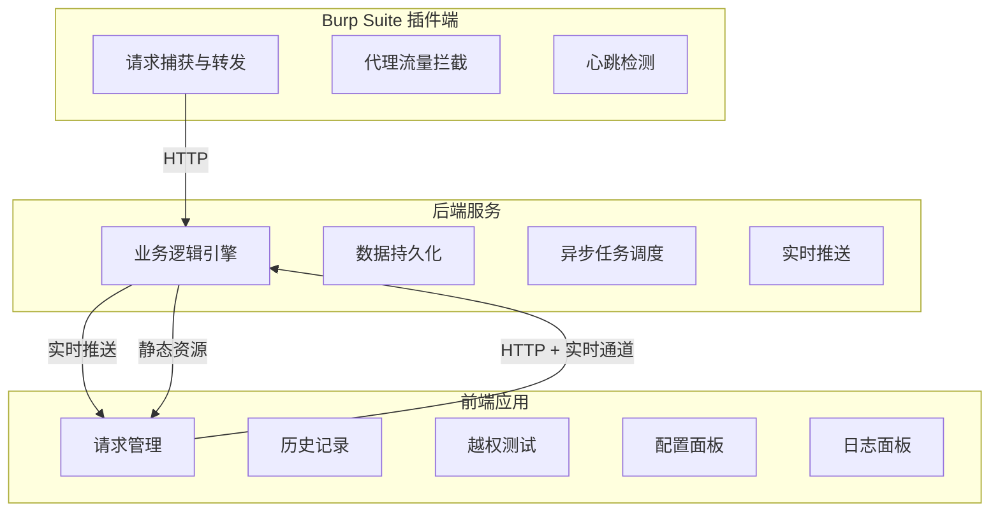
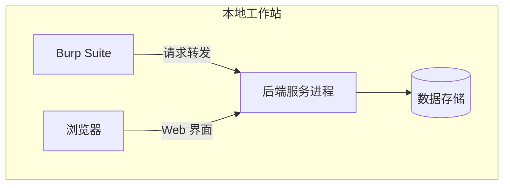
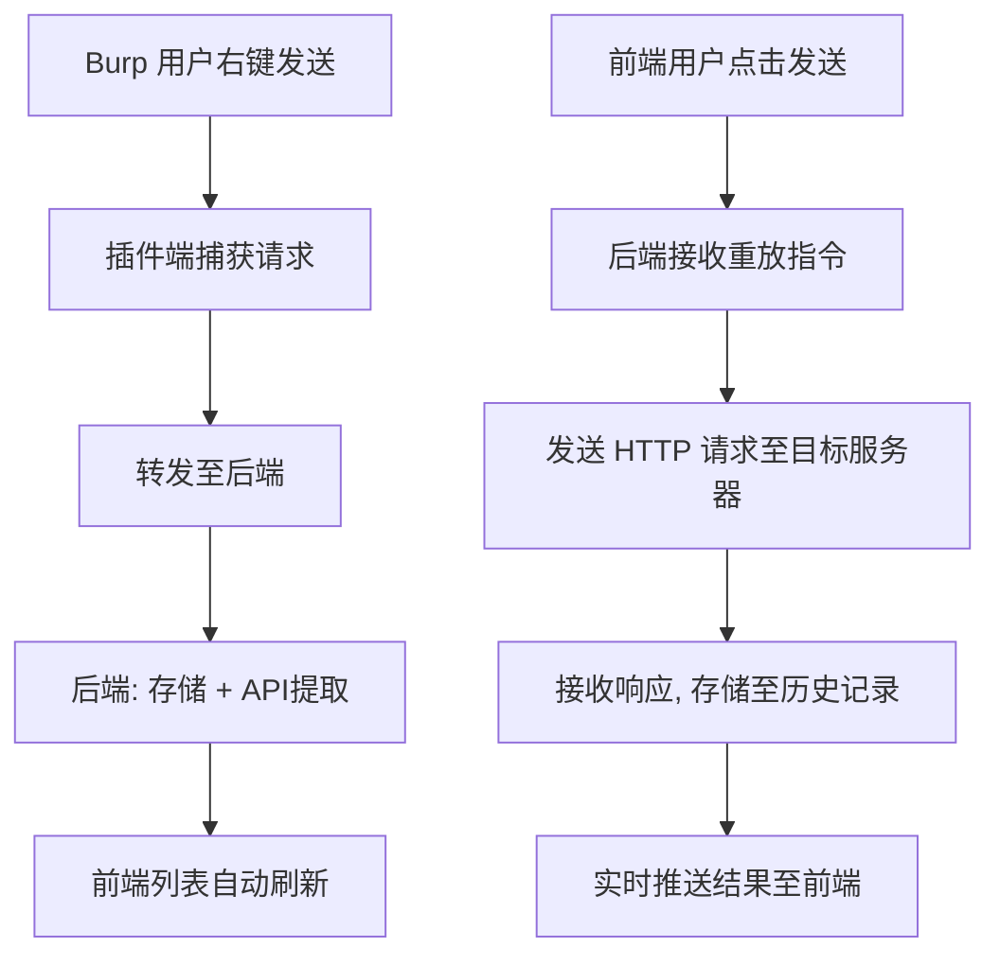
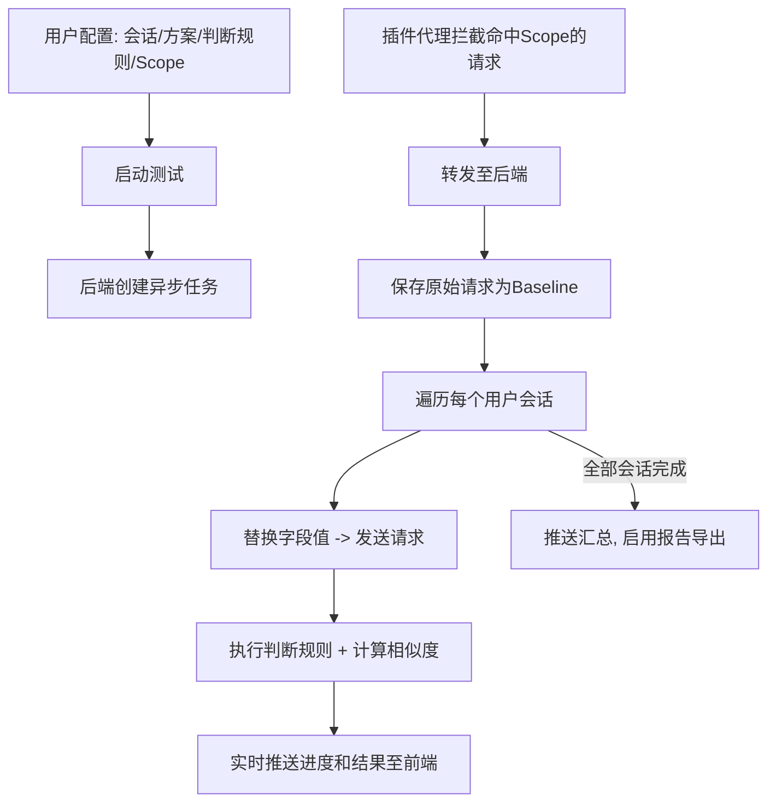
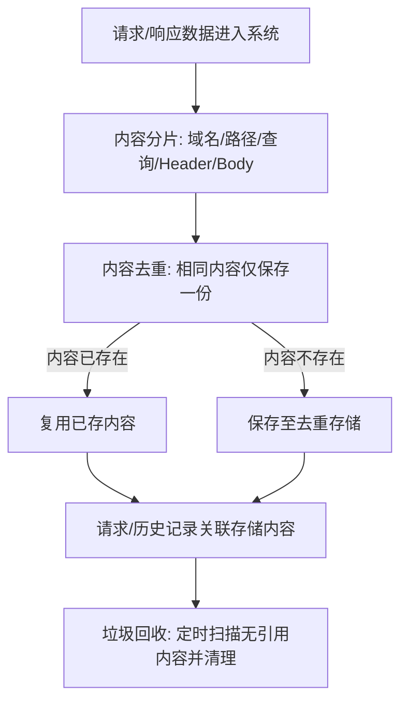
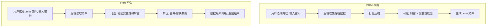

# Repeater Manager 分离式架构产品需求文档 (PRD)

> 版本: v3.0
> 日期: 2026-08-10
> 状态: 已更新
> 基于: Repeater Manager v2.41.0 实际功能

---

## 目录

1. [项目概述](#1-项目概述)
2. [系统整体架构](#2-系统整体架构)
3. [组件间通信概述](#3-组件间通信概述)
4. [功能规格说明](#4-功能规格说明)
5. [核心业务流程](#5-核心业务流程)
6. [非功能需求](#6-非功能需求)
7. [附录](#7-附录)

---

## 1. 项目概述

### 1.1 产品定位

Repeater Manager 是一款面向安全测试人员的 Burp Suite 高级插件，提供 HTTP 请求重放管理、自动化越权检测、报文比对分析等能力。本产品从现有单体 Swing 插件演进而来的分离式架构版本，旨在解决单体架构在 UI 体验、扩展性和部署灵活性方面的瓶颈。

### 1.2 产品目标

将现有单体 Burp Suite 插件重构为分离式三组件架构，在完整继承现有功能的基础上实现：

- **现代化交互体验**: 前端应用提供媲美主流开发工具的 Web 界面，替代传统 Swing UI
- **独立可部署**: 后端服务与 Burp Suite 解耦，可独立运行、独立升级
- **轻量化插件端**: Burp 插件仅保留请求捕获和转发职责，降低对 Burp 的资源占用
- **可扩展**: 新功能可在后端或前端独立开发，不依赖 Burp 插件框架

**三组件分工**:
- **Burp Suite 插件端**: HTTP 请求/响应报文的捕获、转发和回显
- **后端服务**: 所有业务逻辑、数据持久化、HTTP 请求发送、异步任务处理
- **前端应用**: Web 用户界面，负责交互展示和本地 UI 逻辑

### 1.3 功能范围

本产品完整继承现有 Repeater Manager 全部功能特性，按模块划分如下：

| 功能模块 | 功能说明 |
|----------|----------|
| 请求管理 | 请求列表展示、多维度搜索过滤（关键字/方法/域名/颜色/API路径）、颜色标记、备注编辑、列显示控制、分页加载、一键清空报文（联动清空历史与请求/响应面板） |
| 请求编辑与重放 | 请求报文编辑、语法高亮、异步发送、超时控制、HTTP/2 支持、空白请求模板创建 |
| 响应管理 | 响应状态/耗时/长度展示、响应报文字段级查看、4 种布局切换（左右分栏/上下分栏/仅请求/仅响应） |
| 历史记录 | 自动录制每次重放响应、历史列表分页查询、高级搜索（9 种过滤条件组合）、统计信息栏 |
| 报文比对 | 请求/响应双模式比对、字符串级行内差异高亮、双栏同步滚动、差异导航（上一处/下一处）、差异数量统计 |
| API 规则提取 | 可配置规则引擎（4 种提取源 x 4 种提取方法）、全局规则 + 项目规则、首匹配优先策略、规则变更后自动静默重提取 |
| 越权测试 | 多用户会话管理、方案配置、6 种字段类型、字段自动替换、规则组模式判决（单活跃规则组、组内条件 AND/OR 混合组合、5 种目标 x 9 种方法）、判决规则持久化（跨会话保留）、Scope 自动拦截、API 去重引擎、4 种相似度算法、实时进度展示 |
| 用户信息管理 | 被测用户身份管理（角色、用户名、匿名标记）、权限证明截图管理、报告自动嵌入用户信息与截图 |
| 测试信息配置 | 测试目标名称/入口/截图、测试时间段与人员、报告标题与副标题自定义 |
| 数据持久化 | 结构化数据持久化、内容去重存储（减少冗余）、大内容外置存储、数据版本自动升级、全局配置（API规则/判决规则/去重配置）跨会话保留 |
| 导入导出 | ERM 加密存档格式（密码保护）、Postman Collection v2.1 导入导出、智能格式检测 |
| 报告生成 | PDF / HTML / Markdown / 加密容器 4 种格式，含 cURL 命令片段和 Postman 代码片段；HTML 报告截图灯箱轮播、越权测试用例参考文档（9 个参考用例） |
| 后台服务 | 定时自动保存、垃圾回收（零引用数据清理）、历史记录自动录制 |
| 日志系统 | 多通道日志输出（Burp 控制台/滚动文件/UI 面板）、5 级日志级别过滤 |
| 配置管理 | 存储模式配置、会话目录管理、日志配置、代理配置、API 规则配置、越权测试全项配置（会话/方案/字段/判断规则/Scope/去重/重放/用户信息/测试信息） |
| 表格即时编辑 | 去重配置/方案/字段定义的"启用""全局"列直接勾选即时生效并持久化 |
| 批量操作 | 批量重放、批量越权测试、批量删除 |
| 使用引导 | 内置使用教程面板、关于面板 |

---

## 2. 系统整体架构

### 2.1 架构概览

产品采用分离式三组件架构，各组件通过标准网络协议通信：

### 2.2 组件职责边界

#### 2.2.1 Burp Suite 插件端

**职责范围**:
- 拦截 Burp Suite 右键"发送到 Repeater Manager"操作，捕获 HTTP 请求报文及服务信息并转发至后端
- 代理拦截匹配 Scope 规则的流量，转发至后端触发越权测试
- 接收后端返回的响应数据，可选回显至 Burp 原生编辑器
- 定期检测后端服务存活状态，失联时提示用户

**不负责**: 任何业务逻辑处理、数据库操作、UI 渲染（除 Burp 原生编辑器外）、异步任务执行

#### 2.2.2 后端服务

**职责范围**:
- 全部业务逻辑：请求管理、历史记录、API 规则提取、越权测试、报文比对、报告生成
- 数据持久化：结构化数据存储、内容去重存储、数据版本升级管理
- HTTP 请求发送：向目标服务器发送 HTTP/1.1 和 HTTP/2 请求
- 异步任务调度：请求重放、批量越权测试、垃圾回收、自动保存
- 实时数据推送：越权测试进度、日志流、系统通知
- 前端静态资源托管

#### 2.2.3 前端应用

**职责范围**:
- 全部用户界面渲染和交互
- 全局状态管理（请求列表、历史记录、配置等）
- 请求报文编辑、报文比对、差异导航、搜索过滤等本地交互逻辑
- 数据展示：表格、代码高亮、差异标注、进度条
- 与后端的 HTTP 请求/响应通信和实时数据接收

### 2.3 部署形态

三组件部署于安全测试人员的本地工作站，通过 localhost 网络通信：

---

## 3. 组件间通信概述

### 3.1 通信方式

| 通道 | 用途 | 说明 |
|------|------|------|
| HTTP | 请求/响应式数据交互 | 前端与后端、插件与后端之间的增删改查操作，以标准数据格式交换 |
| 实时通道 | 服务端主动推送 | 越权测试进度、重放结果通知、日志流、系统通知等实时数据推送 |

### 3.2 实时推送场景

| 推送事件 | 触发时机 |
|----------|----------|
| 越权测试进度 | 测试任务执行过程中，实时更新当前进度、正在测试的请求和会话 |
| 越权测试结果 | 每条测试完成时，推送判断结果、相似度、响应时间 |
| 越权测试完成 | 全部测试完成后，推送汇总数据 |
| 请求发送完成 | 每次重放完成后，推送状态码、响应长度、耗时 |
| 日志推送 | 后端日志实时输出至前端面板 |
| 系统通知 | 垃圾回收完成、自动保存完成、配置变更等 |

### 3.3 核心数据概念

产品涉及以下核心数据实体（概念层面，非数据库 Schema）：

- **请求 (Request)**: 一条待管理/重放的 HTTP 请求，包含协议、域名、路径、方法、完整报文、备注、颜色标记、提取的 API 路径
- **历史记录 (History)**: 每次重放的响应快照，包含状态码、响应体、响应耗时、关联的请求
- **用户会话 (UserSession)**: 一个越权测试身份，包含字段值、关联的方案、超时/重试/并发等重放参数及关联的用户信息
- **用户信息 (UserInfo)**: 与用户会话关联的被测用户身份信息，包含角色、用户名、匿名标记及权限证明截图
- **方案 (Scheme)**: 一组字段的集合，定义某个认证体系的凭据分布在报文的哪些位置
- **字段 (FieldDefinition)**: 身份凭据在 HTTP 报文中的具体定位，支持 Header、JSON Body、XML Body、表单字段、Multipart 字段、URL 参数等位置类型
- **测试信息配置 (TestInfoConfig)**: 越权测试报告的可选元信息，包含测试目标名称/入口/截图、测试时间段、测试人员、报告标题与副标题
- **API 提取规则 (ApiExtractionRule)**: 从报文中提取 API 路径标识的规则，支持多种来源和提取方法
- **判断规则 (JudgmentRule)**: 越权测试中判定响应是否代表越权成功的规则，以规则组形式组织，同一时刻仅一个活跃规则组生效，组内条件支持 AND/OR 混合组合；规则可标记为持久化以跨会话保留
- **Scope 条目 (ScopeEntry)**: 自动越权测试的 URL 匹配范围

---

## 4. 功能规格说明

### 4.1 Burp Suite 插件端

#### 4.1.1 右键菜单集成

- 在 Burp Suite 的 Proxy / History / Repeater 等模块的右键菜单中提供"发送到 Repeater Manager"选项
- 用户点击后，插件将当前选中的 HTTP 请求完整报文和服务信息转发至后端

#### 4.1.2 代理拦截器

- 在 Burp 代理中注册 HTTP 请求/响应处理器
- 当请求匹配用户配置的 Scope 规则时，自动将请求转发到后端进行越权测试
- 拦截过程不应影响正常的代理流量（非阻塞式转发）

#### 4.1.3 心跳检测

- 插件启动后，定期（每 30 秒）向后端发送健康检查请求
- 后端无响应时，在 Burp 输出面板提示用户"后端服务未启动"
- 后端恢复后，自动恢复正常工作

### 4.2 后端服务功能规格

#### 4.2.1 请求管理服务

- 接收并存储来自插件端的新请求
- 提供请求列表的查询、分页、排序、过滤功能
- 支持按关键字、HTTP 方法、域名、颜色、API 路径等多维度筛选
- 支持请求的增删改查操作
- 支持批量删除请求
- 请求数据变更后，通过实时通道通知前端刷新

#### 4.2.2 历史记录服务

- 每次请求重放后，自动记录响应结果到历史记录
- 提供历史记录列表的查询、分页、筛选功能
- 支持按状态码、时间范围、关键字等条件筛选
- 支持历史记录的重放（使用原始请求重新发送）
- 支持批量重放历史记录
- 提供高级搜索功能（多条件复合筛选）

#### 4.2.3 请求重放服务

- 接收前端发送的重放请求
- 解析请求报文，提取目标地址信息
- 支持用户自定义超时时间
- 支持 HTTP/2 协议（失败自动回退到 HTTP/1.1）
- 支持代理配置
- 发送请求到目标服务器并接收响应
- 将响应结果保存到历史记录
- 通过实时通道通知前端重放完成

#### 4.2.4 API 规则提取服务

- 提供可配置的规则引擎，支持 4 种提取源和 4 种提取方法
- 支持全局规则（所有项目共享）和项目规则（仅当前项目有效）
- 规则按优先级排序，first-match-wins 策略
- 请求创建/更新时自动执行 API 提取
- 规则变更后，自动对所有现有请求静默重提取
- 支持手动触发单条/批量请求的 API 重提取

#### 4.2.5 越权测试服务

**会话管理**:
- 用户会话（UserSession）的完整 CRUD，每个会话绑定独立的字段值和方案
- 支持从剪贴板或请求报文中智能解析会话信息（自动提取字段值）
- 支持会话启用/禁用、颜色标记

**用户信息管理**:
- 每个用户会话可关联一份用户信息（UserInfo），记录被测用户的角色、用户名及匿名标记
- 匿名用户自动创建并绑定默认角色，支持在方案选择时智能匹配
- 支持为被测用户添加权限证明截图（多张），并提供截图查看界面
- 用户信息随报告自动导出，截图以嵌入方式呈现

**方案与字段管理**:
- 方案（Scheme）：定义一组字段集合，对应某个认证体系的凭据分布
- 字段（FieldDefinition）：支持 6 种位置类型 — HTTP Header、JSON Body、XML Body、表单字段、Multipart 字段、URL 参数
- 字段替换引擎：根据字段配置自动替换报文中的身份凭据；支持空值（移除对应字段值）
- 方案和字段均支持全局持久化（跨会话复用）
- 方案/字段列表的"启用""全局"列支持表格内直接勾选，即时生效并持久化

**判断规则引擎（规则组模式）**:
- 判断规则以规则组（Rule Group）形式组织，同一时刻仅一个活跃规则组生效，组内条件支持 AND/OR 混合组合（条件级逻辑运算符），并支持 NOT 取反
- 5 种判断目标：状态码、响应头、响应体、相似度、响应时间
- 9 种判断方法：正则匹配、包含、不包含、等于、不等于、大于、小于、数值等于、长度差异
- 编辑对话框按条件行组织，首行不显示逻辑连接符，后续行可选择与前一条件的 AND/OR 关系
- 三层判决兜底：基准响应无效 → 判为错误；活跃规则组条件满足 → 越权；无活跃规则组或不满足时 → 回退默认相似度判决（相似度不低于 0.90 判定为越权）
- 支持成功/失败的自定义颜色标记和备注

**判决规则持久化**:
- 规则组可标记"持久化"，持久化规则跨会话保留，插件重新启动后自动恢复
- 未标记持久化的规则为临时规则，仅当前会话有效

**相似度引擎**:
- 根据响应内容类型自动选择适配的相似度计算方式（JSON/XML 结构感知、文本 n-gram、二进制长度比等）
- 响应噪声过滤（时间戳、随机数等动态内容）

**Scope 自动拦截**:
- 配置 URL 匹配模式，代理拦截命中 Scope 的流量自动触发越权测试
- 拦截过程不影响正常代理流量

**API 去重引擎**:
- 可配置去重策略（按 API 路径/完整 URL/请求内容特征等维度去重）
- 可配置保留策略（保留首次/最后一次/全部）
- 减少重复 API 的越权测试开销

**测试执行**:
- 支持单请求和批量请求的越权测试
- 每个用户会话并发测试，并发数可配置
- 支持重试机制（重试次数和延迟可配置）
- 原始请求作为 Baseline 基准对比

**结果与报告**:
- 实时推送每条测试的判定结果和相似度
- 测试完成后汇总展示
- 生成 PDF / HTML / Markdown / 加密容器 4 种格式报告，含 cURL 命令和 Postman 代码片段
- 报告自动嵌入测试信息配置（标题/副标题/目标/截图/时间段/人员）与用户信息（角色/用户名/截图）
- HTML 报告支持截图灯箱轮播（分组浏览、键盘左右切换、Esc 关闭、图片计数、加载指示）
- 报告附带越权测试用例参考文档（未授权/垂直越权/水平越权共 9 个参考用例，含测试方法说明）

#### 4.2.6 报文比对服务

- 接收两条历史记录 ID，返回比对结果
- 支持字符串模式和 Hex 模式比对
- 返回差异位置、差异类型（新增/删除/修改）

#### 4.2.7 导入导出服务

- **ERM 格式**: 自定义加密存档格式，支持密码保护（可选加密与完整性校验）
- **Postman Collection v2.1**: 标准格式导出，兼容 Postman/Apifox 等工具
- **智能格式检测**: 导入时自动识别文件格式
- **导入策略**: 支持覆盖导入和合并导入

#### 4.2.8 数据持久化服务

- 结构化数据持久化存储，支持自动/指定目录/指定文件多种存储模式
- 采用内容去重存储机制减少冗余：相同内容仅保存一份，删除数据后由后台服务定期回收
- 大体积内容外置存储到文件系统
- 数据版本自动升级，升级过程不丢失用户数据
- 数据文件存储在用户会话目录下
- 全局配置（API 提取规则、判决规则、去重配置）以独立文件形式跨会话保留

#### 4.2.9 后台服务

- **自动保存**: 定时（可配置间隔，默认 5 分钟）自动保存数据
- **垃圾回收**: 定时（默认 10 分钟）清理无引用数据，支持工具栏自动/手动切换
- **日志服务**: 多通道日志（控制台/文件/UI），支持级别过滤

### 4.3 前端应用功能规格

#### 4.3.1 请求列表面板

- 以数据表格形式展示请求列表
- 支持列显示控制（显示/隐藏列、调整列宽、拖拽排序）
- 支持行颜色标记和备注编辑
- 支持多选和批量操作
- 支持右键菜单（发送、删除、编辑颜色/备注等）
- 支持搜索过滤和高级筛选
- 支持分页和虚拟滚动（大数据量优化）
- 支持按列排序
- 支持 API 路径列的展示和编辑

#### 4.3.2 请求编辑面板

- 提供请求报文的文本编辑器，支持语法高亮
- 支持请求行（方法、URL、协议版本）的编辑
- 支持请求头和请求体的编辑
- 支持发送按钮触发重放
- 支持创建空白请求模板

#### 4.3.3 响应查看面板

- 展示响应状态码、响应时间、响应长度
- 提供响应报文的文本展示，支持语法高亮
- 支持布局切换（左右分屏/上下分屏/仅请求/仅响应）

#### 4.3.4 历史记录面板

- 展示选中请求的历史记录列表
- 支持按状态码、时间范围、关键字筛选
- 支持历史记录的重放和删除
- 支持高级搜索（多条件复合筛选）
- 支持状态栏统计信息展示

#### 4.3.5 报文比对对话框

- 支持选择两条历史记录进行比对
- 模式切换：字符串模式 / Hex 模式
- 布局切换：双 Tab 模式（请求比对 / 响应比对）/ 四面板模式
- 差异展示：高亮显示差异部分
- 差异导航：上一处/下一处按钮
- 差异统计：显示差异数量
- 同步滚动：两侧同步滚动

#### 4.3.6 配置面板

- 存储配置：数据库文件路径、自动保存间隔
- 日志配置：日志级别、输出通道、文件路径
- 代理配置：代理地址、代理端口、代理类型
- API 规则配置：规则列表、规则编辑、优先级调整
- 越权测试配置：用户会话、字段、方案、判断规则、Scope、去重配置、重放配置、用户信息、测试信息

#### 4.3.7 越权测试面板

- 用户会话管理：创建、编辑、删除、启用/禁用，支持从剪贴板/报文解析会话
- 用户信息管理：角色/用户名/匿名标记设置、权限证明截图的添加与查看
- 测试信息配置：测试目标名称/入口/截图、时间段、人员、报告标题/副标题设置
- 方案配置：创建和管理方案（关联方案与字段）
- 字段配置：6 种位置类型的添加、编辑、删除
- 判断规则配置：规则组的创建/编辑（目标、方法、表达式）、组内条件 AND/OR 混合组合与 NOT 取反、活跃规则组切换、持久化标记、成功/失败颜色标记
- Scope 配置：URL 匹配模式的添加、编辑、删除
- API 去重配置：去重策略和保留策略的设置
- 重放配置：超时、并发数、重试次数/延迟、重放延迟等参数
- 自动检测控制：启动/停止自动越权测试
- 实时进度展示：进度条、当前请求和会话信息
- 实时结果展示：表格展示每条测试结果（判定结果、相似度、响应时间）
- 测试完成后汇总展示
- 报告导出按钮（PDF / HTML / Markdown / 加密容器）

#### 4.3.8 日志面板

- 实时展示系统日志
- 支持日志级别过滤
- 支持关键字搜索
- 支持清空日志
- 支持日志导出

---

## 5. 核心业务流程

### 5.1 请求捕获与重放

### 5.2 越权测试

### 5.3 数据持久化

### 5.4 导入导出

---

## 6. 非功能需求

### 6.1 性能要求

| 场景 | 目标 |
|------|------|
| 请求重放延迟（不含网络） | 后端处理 < 100ms |
| 历史记录加载（1000条） | < 500ms |
| 请求列表首次加载（50条/页） | < 300ms |
| 越权测试并发会话数 | 用户可配置，支持 >= 10 |
| 前端首屏加载 | < 2s |
| 后端内存占用（常规使用） | < 200MB |
| 实时推送延迟 | < 50ms |

### 6.2 异步操作

以下操作必须异步执行，避免阻塞用户交互：

| 操作 | 触发方式 | 结果通知方式 |
|------|----------|-------------|
| 请求重放 | 用户点击发送 | 实时推送 |
| 批量重放 | 用户多选后触发 | 实时逐条推送 |
| 越权测试 | 用户启动 / 代理拦截触发 | 实时进度 + 结果推送 |
| 批量越权测试 | 用户多选后触发 | 实时进度 + 结果推送 |
| 垃圾回收 | 定时 / 手动触发 | 完成通知 |
| 自动保存 | 定时触发 | 静默执行 |
| API 静默重提取 | 规则变更后自动触发 | 静默执行 |
| 报告生成 | 用户点击导出 | 返回下载链接 |
| 导入导出 | 用户操作 | 进度通知 |

### 6.3 资源保护

| 约束项 | 说明 |
|--------|------|
| 请求体大小限制 | 超大请求体应拒绝存储并提示用户 |
| 并发请求数限制 | 防止后端过载 |
| 越权测试并发控制 | 受用户配置的 maxConcurrent 参数限制 |
| 任务队列容量 | 超过容量时拒绝新任务并提示 |
| 日志文件滚动 | 按大小滚动，最大备份数可配置 |
| 自动保存间隔 | 最小间隔限制，防止频繁 IO |
| 实时连接数 | 限制同时连接数，防止资源耗尽 |

### 6.4 兼容性与可靠性

| 类别 | 要求 |
|------|------|
| 兼容性 | Burp Suite Professional 2024+；主流现代浏览器 |
| 安全 | 所有通信仅监听 localhost；数据加密存档 |
| 可靠性 | 自动保存间隔可配置；异常崩溃后数据不丢失 |
| 跨平台 | 支持 Windows / Linux / macOS |

---

## 7. 附录

### 7.1 现有功能映射表

| 现有功能 | 新架构实现 | 负责组件 |
|----------|-----------|----------|
| 请求列表面板 | 请求列表组件 + 数据表格 | 前端 |
| 请求编辑面板 | 请求编辑器组件 | 前端 |
| 响应面板 | 响应查看器组件 | 前端 |
| 历史记录面板 | 历史记录列表组件 + 统计栏 | 前端 |
| 报文比对 | 报文比对对话框 + 差异查看器 | 前端 + 后端 |
| 配置面板 | 配置视图 + 各配置子组件 | 前端 |
| API 规则配置 | API 规则配置组件 | 前端 |
| 越权测试面板 | 越权测试主面板（含会话/方案/判断规则/Scope/去重配置/用户信息/测试信息） | 前端 |
| 日志面板 | 日志面板组件 | 前端 |
| 使用教程面板 | 使用教程面板 | 前端 |
| 请求发送 | HTTP 请求发送器 | 后端 |
| 历史记录录制 | 历史记录服务 | 后端 |
| API 提取引擎 | API 提取引擎 | 后端 |
| 越权测试引擎 | 越权测试服务 | 后端 |
| 判断引擎 | 判断规则引擎（规则组 + AND/OR 混合 + 持久化） | 后端 |
| 字段替换 | 字段替换引擎（6 种位置类型） | 后端 |
| 相似度计算 | 相似度引擎（内容感知） | 后端 |
| 会话解析 | 会话解析引擎（剪贴板/报文） | 后端 |
| 用户信息管理 | 用户信息管理服务（角色/用户名/匿名/截图） | 后端 |
| 测试信息配置 | 测试信息配置服务（目标/入口/截图/时间段/人员/标题） | 后端 |
| API 去重 | API 去重引擎 | 后端 |
| 报告生成 | 报告生成服务（PDF/HTML/MD/加密容器 + cURL/Postman 代码片段 + 用例参考） | 后端 |
| 数据导入导出 | 导入导出服务（ERM/Postman） | 后端 |
| 内容去重存储 | 内容去重存储服务 | 后端 |
| 垃圾回收 | 垃圾回收服务 | 后端 |
| 自动保存 | 自动保存服务 | 后端 |
| 日志系统 | 日志工具 | 后端 |
| 右键菜单 | 右键菜单提供者 | 插件 |
| 代理拦截 | 代理拦截器（Scope 匹配） | 插件 |
| 心跳检测 | 心跳检测 | 插件 |

### 7.2 风险与应对

| 风险 | 应对措施 |
|------|----------|
| HTTP/2 等特殊请求发送兼容性 | 充分测试各场景，保留回退机制 |
| 前端代码编辑器体积影响首屏加载 | 按需加载，代码分割 |
| 实时推送连接不稳定 | 自动重连机制，关键操作 HTTP 轮询兜底 |
| 数据并发写入性能 | 批量操作使用事务，优化存储策略 |
| 跨平台行为差异 | 充分的多平台测试 |
| 数据迁移失败导致用户数据丢失 | 迁移前自动备份，提供回滚方案 |

### 7.3 术语表

| 术语 | 说明 |
|------|------|
| 内容去重存储 | 相同内容仅保存一份的存储机制，减少数据冗余 |
| Baseline | 越权测试中的原始请求（未替换字段值），作为对比基准 |
| 字段 | 身份凭据在 HTTP 报文中的具体定位，支持 Header / JSON Body / XML Body / 表单字段 / Multipart 字段 / URL 参数 |
| 方案 | 一组字段的集合，对应某个认证体系的凭据分布方式 |
| 判断规则 | 用于判定响应是否代表越权成功的规则，以规则组形式组织，组内条件支持 AND/OR 混合组合 |
| 活跃规则组 | 同一时刻仅一个生效的判断规则组，测试判决优先使用 |
| 持久化规则 | 标记为持久化的判断规则，跨会话保留并在插件重启后自动恢复 |
| Scope | 越权测试自动拦截的 URL 匹配范围 |
| ERM | Repeater Manager 专用的加密存档格式 |
| first-match-wins | API 规则提取的优先级策略，第一个匹配的规则即生效 |
| GC | 垃圾回收，指清理无引用数据的后台服务 |
| Diff | 差异比对，用于对比两条 HTTP 报文的内容差异 |

---

> 本文档为 Repeater Manager 分离式架构的产品需求文档，描述产品应实现的功能和行为，不涉及具体技术实现方案。后续开发应以此文档为功能基准，技术实现细节在专项设计文档中定义。如有需求变更，需同步更新本文档。
