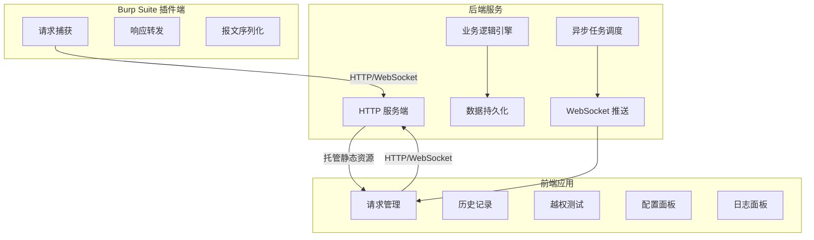
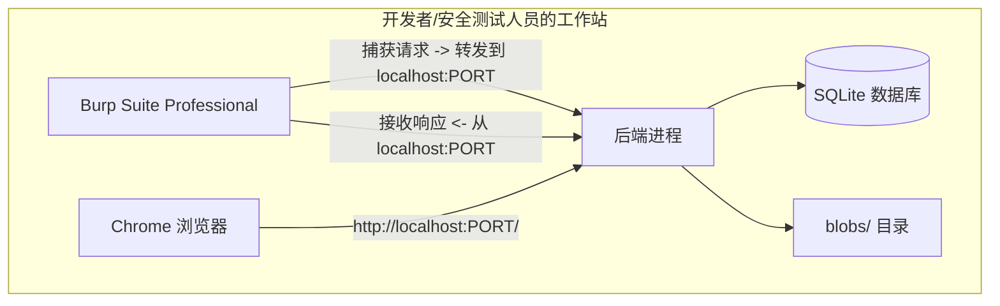
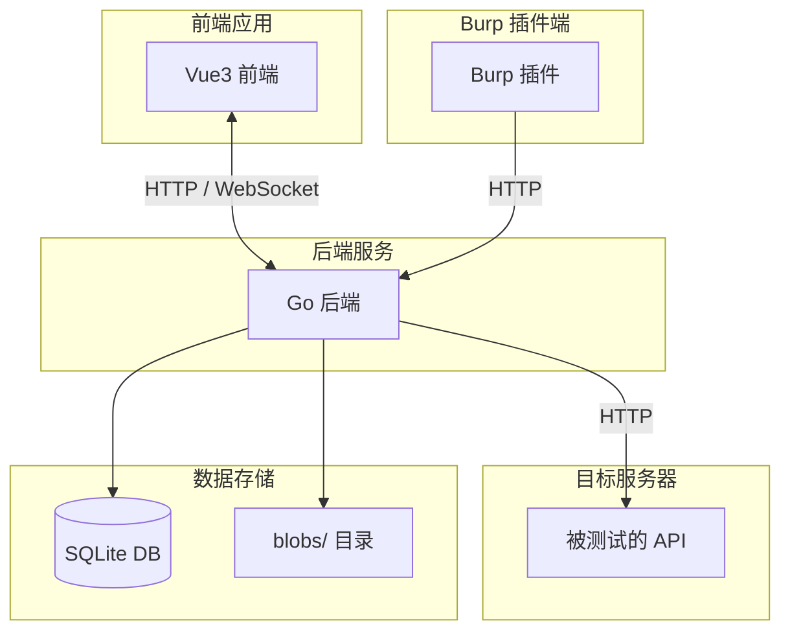
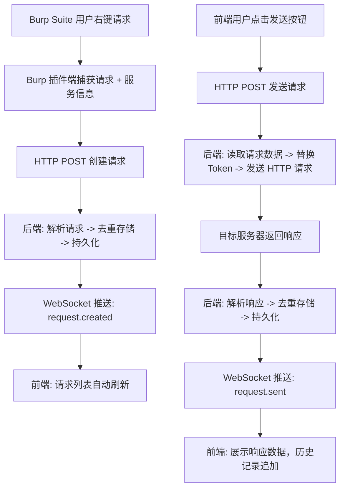
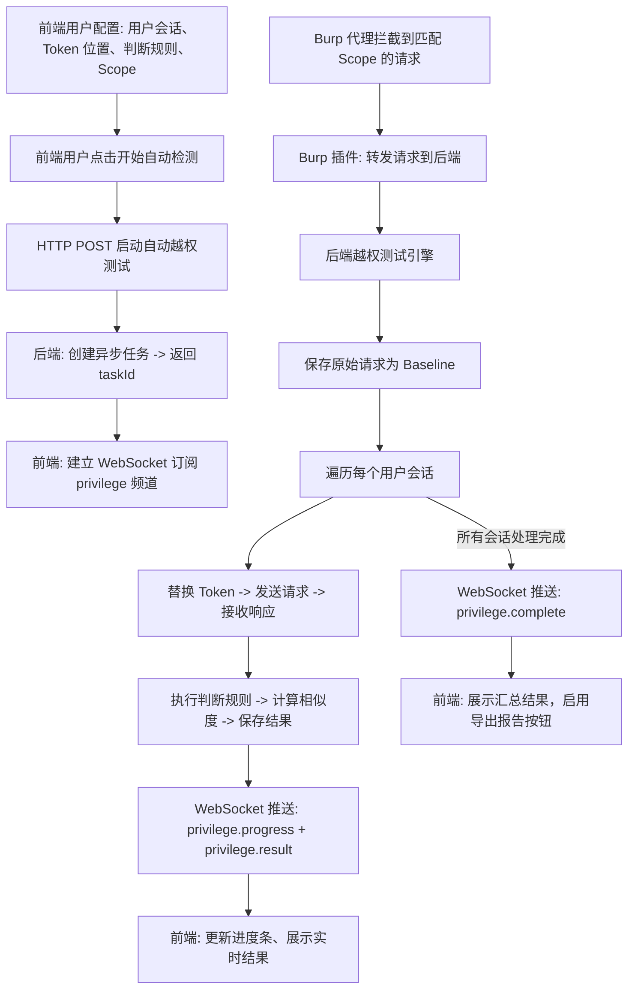
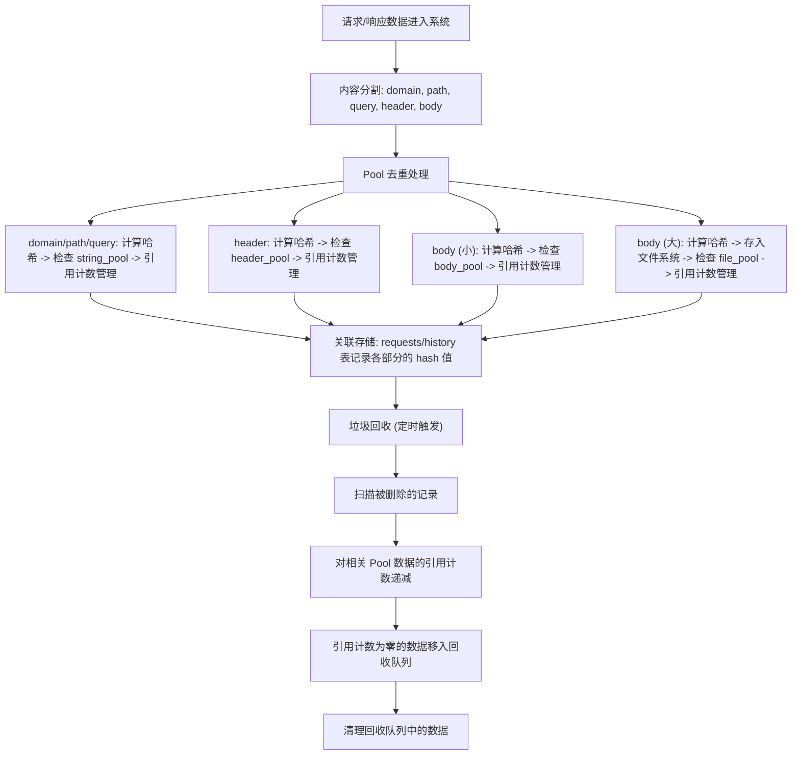

# Repeater Manager 分离式架构产品需求文档 (PRD)

> 版本: v1.0
> 日期: 2026-06-26
> 状态: 草案
> 基于: Repeater Manager v2.24.0

---

## 目录

1. [项目概述](#1-项目概述)
2. [系统整体架构设计](#2-系统整体架构设计)
3. [通信协议与接口定义](#3-通信协议与接口定义)
4. [各组件功能规格说明](#4-各组件功能规格说明)
5. [数据流向与处理流程](#5-数据流向与处理流程)
6. [性能要求与异步操作设计](#6-性能要求与异步操作设计)
7. [附录](#7-附录)

---

## 1. 项目概述

### 1.1 背景与目标

现有 Repeater Manager 是一个基于 Java Swing + Montoya SDK 的 Burp Suite 插件，所有功能（UI 渲染、业务逻辑、数据持久化、HTTP 请求发送）均在一个 JAR 包内运行。随着功能不断扩展，单体架构面临以下问题：

- **UI 体验受限**: Java Swing 界面老旧，交互体验差，难以实现现代化 UI 效果
- **内存占用高**: JVM 堆内存占用大，Burp Suite 本身已消耗大量资源
- **扩展性差**: 新功能开发受限于 Swing 组件和单线程模型
- **部署耦合**: 所有逻辑绑定在 Burp 插件中，无法独立使用

**本项目目标**: 将现有 Repeater Manager 重构为分离式三组件架构：
- **Burp Suite 插件端**: 仅负责 HTTP 请求/响应报文的捕获和转发
- **后端服务**: 承担所有业务逻辑、数据持久化、异步任务处理
- **前端应用**: 提供现代化的 Web 用户界面，由后端托管静态资源

### 1.2 功能范围

完整保留现有 v2.24.0 所有功能特性，包括但不限于：

| 功能模块 | 功能说明 |
|----------|----------|
| 请求管理 | 请求列表展示、搜索过滤、颜色标记、备注、列显示控制 |
| 请求编辑与重放 | 请求内容编辑、语法高亮、异步发送、超时控制、HTTP/2 支持 |
| 响应管理 | 响应展示、布局切换（左右/上下/仅请求/仅响应） |
| 历史记录 | 自动记录每次重放的响应、历史回放、高级搜索（多条件复合筛选） |
| 报文比对 | 字符串级/字节级差异对比、语法高亮差异展示、同步滚动、差异导航 |
| API 规则提取 | 可配置规则引擎（4 种提取源 x 4 种提取方法）、全局规则 + 项目规则、自动重提取 |
| 越权测试 | 多用户会话管理、Token 位置配置、Token 自动替换、判断规则配置、自动化检测引擎、报告生成 |
| 数据持久化 | SQLite 存储、Pool 去重架构（SHA-256 哈希 + 引用计数）、文件外置存储 |
| 导入导出 | ERM 加密存档（AES-256-CBC + HMAC-SHA256）、Postman Collection v2.1、智能格式检测 |
| 后台服务 | 自动保存、垃圾回收（Pool 零引用清理）、历史记录录制 |
| 日志系统 | 多通道日志（控制台/文件/UI）、级别过滤 |
| 配置管理 | 存储配置、日志配置、代理配置、API 规则配置、越权测试配置 |
| 批量操作 | 批量重放、批量越权测试、批量删除 |
| 报告生成 | PDF / HTML / Markdown 格式报告，含 cURL/Postman 代码片段 |

### 1.3 非功能需求

| 类别 | 要求 |
|------|------|
| 性能 | 请求重放延迟 < 100ms（不含网络传输）；历史记录加载 < 500ms（1000 条）；越权测试并发 >= 10 |
| 资源 | 后端内存占用 < 200MB（常规使用）；前端页面首屏加载 < 2s |
| 兼容性 | 支持 Burp Suite Professional 2024+；Chrome 浏览器 |
| 安全 | 后端 API 无认证（本地运行假设）；WebSocket 仅监听 localhost |
| 可靠性 | 数据自动保存间隔可配置；异常崩溃后数据不丢失 |

---

## 2. 系统整体架构设计

### 2.1 架构概览



### 2.2 组件职责边界

#### 2.2.1 Burp Suite 插件端

| 职责 | 说明 |
|------|------|
| 请求捕获 | 拦截右键"发送到 Repeater Manager"操作 |
| 请求转发 | 将原始 HTTP 请求字节数组 + 服务信息（host/port/secure/protocol）转发给后端 |
| 响应接收 | 接收后端返回的响应数据，回显到 Burp 的原生编辑器（可选，仅用于调试） |
| 代理拦截 | 拦截匹配 Scope 的流量，转发给后端进行越权测试 |
| 心跳检测 | 定期检测后端服务是否存活，失联时提示用户 |

**明确不做的事**:
- 不处理任何业务逻辑（请求存储、历史记录、API 提取、越权判断等）
- 不直接操作数据库
- 不渲染任何 UI 界面（除 Burp 原生编辑器外）
- 不执行任何异步任务

#### 2.2.2 后端服务

| 职责 | 说明 |
|------|------|
| HTTP 服务端 | 提供标准 HTTP 接口，处理前端和插件端的请求 |
| WebSocket 服务端 | 提供实时推送通道（越权测试进度、日志流、通知） |
| 业务逻辑引擎 | 请求管理、历史记录、API 提取、越权测试、报文比对、报告生成 |
| 数据持久化 | 数据库操作、Pool 去重架构、Schema 迁移 |
| 异步任务调度 | 请求重放、批量越权测试、垃圾回收、自动保存 |
| 静态资源托管 | 托管编译后的前端静态文件 |
| 报文发送 | 发送 HTTP 请求到目标服务器 |

#### 2.2.3 前端应用

| 职责 | 说明 |
|------|------|
| 用户界面渲染 | 使用现代化 UI 组件库构建界面 |
| 状态管理 | 管理全局状态（请求列表、历史记录、配置等） |
| API 调用 | 调用后端 HTTP 接口 |
| 实时通信 | 接收后端推送的实时数据 |
| 本地交互 | 请求编辑、报文比对、差异导航、搜索过滤等纯前端逻辑 |
| 数据展示 | 表格、树形、图表、代码高亮 |

### 2.3 部署形态



### 2.4 技术栈总览

| 组件 | 技术选型 | 版本要求 |
|------|----------|----------|
| Burp 插件 | Java 17 + Montoya SDK | JDK 17+, Montoya 2025.12+ |
| 后端 | Go + Gin + GORM + SQLite | Go 1.22+ |
| 前端 | Vite + Vue3 + PrimeVue 4.x + Pinia | Node 18+ |
| 构建工具 | pnpm (前端) / go mod (后端) / Maven (插件) | - |

---

## 3. 通信协议与接口定义

### 3.1 通信协议总览

| 协议 | 用途 | 连接方 | 说明 |
|------|------|--------|------|
| HTTP (标准服务端) | 请求/响应式 API 调用 | 前端 <-> 后端, 插件 <-> 后端 | 所有接口使用查询参数风格，JSON 数据交换 |
| WebSocket | 实时推送 | 前端 <-> 后端 | 单向/双向推送：越权测试进度、日志流、系统通知 |

### 3.2 HTTP 接口设计规范

**接口风格**: 标准 HTTP 服务端风格，所有参数通过查询参数或请求体传递，**不使用 RESTful 路径参数**。

**URL 格式**:
```
GET  /api/?module=<模块>&action=<动作>&<参数>=<值>
POST /api/?module=<模块>&action=<动作>
```

**示例对比**:

| 操作 | RESTful 风格 (禁用) | 本项目风格 (采用) |
|------|---------------------|-----------------|
| 获取请求详情 | `GET /api/requests/123` | `GET /api/?module=request&action=get&id=123` |
| 删除历史记录 | `DELETE /api/history/456` | `POST /api/?module=history&action=delete&id=456` |
| 更新用户会话 | `PUT /api/sessions/789` | `POST /api/?module=session&action=update&id=789` |
| 搜索请求 | `GET /api/requests?keyword=test` | `GET /api/?module=request&action=search&keyword=test` |

**通用响应格式**:
```json
{
  "code": 0,
  "message": "success",
  "data": { ... }
}
```

**错误码定义**:

| code | 含义 | 说明 |
|------|------|------|
| 0 | 成功 | 请求处理成功 |
| 1001 | 参数错误 | 缺少必要参数或参数格式错误 |
| 1002 | 资源不存在 | 请求的数据不存在 |
| 1003 | 数据库错误 | SQLite 操作失败 |
| 1004 | 请求发送失败 | HTTP 请求发送异常 |
| 1005 | 超时 | 操作超时 |
| 1006 | 内部错误 | 服务端未预期异常 |
| 1007 | 服务未就绪 | 后端未启动或连接失败 |

### 3.3 HTTP 接口清单

#### 3.3.1 请求管理模块 (module=request)

| action | 方法 | 参数 | 说明 |
|--------|------|------|------|
| list | GET | `page`, `pageSize`, `keyword`, `method`, `domain`, `color`, `api` | 获取请求列表 |
| get | GET | `id` | 获取单个请求详情 |
| create | POST | `protocol`, `domain`, `path`, `query`, `method`, `requestData`, `comment`, `color` | 创建新请求 |
| update | POST | `id`, `comment`, `color`, `requestData` | 更新请求 |
| delete | POST | `id` | 删除请求 |
| deleteBatch | POST | `ids` (JSON 数组) | 批量删除请求 |
| updateApi | POST | `id`, `api` | 手动更新 API 路径 |
| reExtractApi | POST | `id` 或 `ids` | 重新执行 API 规则提取 |
| send | POST | `id`, `requestData`, `timeout`, `useHttp2` | 发送请求（重放） |
| createBlank | POST | 无 | 创建空白 GET 请求模板 |
| import | POST | `format`, `data` | 导入数据（ERM/Postman） |
| export | POST | `format`, `ids`, `password` | 导出数据（ERM/Postman） |

#### 3.3.2 历史记录模块 (module=history)

| action | 方法 | 参数 | 说明 |
|--------|------|------|------|
| list | GET | `requestId`, `page`, `pageSize`, `statusCode`, `startTime`, `endTime`, `keyword` | 获取历史记录列表 |
| get | GET | `id` | 获取单个历史记录详情 |
| delete | POST | `id` | 删除历史记录 |
| deleteBatch | POST | `ids` (JSON 数组) | 批量删除历史记录 |
| replay | POST | `id`, `timeout` | 重放历史记录 |
| replayBatch | POST | `ids`, `timeout` | 批量重放历史记录 |
| search | GET | `requestId`, `conditions` (JSON) | 高级搜索 |
| compare | GET | `idA`, `idB` | 获取两条历史记录用于比对 |

#### 3.3.3 越权测试模块 (module=privilege)

| action | 方法 | 参数 | 说明 |
|--------|------|------|------|
| sessionList | GET | 无 | 获取用户会话列表 |
| sessionGet | GET | `id` | 获取用户会话详情 |
| sessionCreate | POST | `name`, `color`, `enabled`, `tokenValues`, `schemeId`, `requestTimeout`, `maxConcurrent`, `retryCount`, `retryDelay`, `replayDelay` | 创建用户会话 |
| sessionUpdate | POST | `id`, ... | 更新用户会话 |
| sessionDelete | POST | `id` | 删除用户会话 |
| tokenLocationList | GET | 无 | 获取 Token 位置列表 |
| tokenLocationCreate | POST | `type`, `expression`, `description`, `persistToGlobal`, `enabled` | 创建 Token 位置 |
| tokenLocationUpdate | POST | `id`, ... | 更新 Token 位置 |
| tokenLocationDelete | POST | `id` | 删除 Token 位置 |
| judgmentRuleList | GET | 无 | 获取判断规则列表 |
| judgmentRuleCreate | POST | `name`, `target`, `method`, `expression`, `enabled`, `priority`, `successColor`, `failureColor`, `successNote`, `failureNote`, `remark`, `global` | 创建判断规则 |
| judgmentRuleUpdate | POST | `id`, ... | 更新判断规则 |
| judgmentRuleDelete | POST | `id` | 删除判断规则 |
| scopeList | GET | 无 | 获取 Scope 列表 |
| scopeCreate | POST | `name`, `urlPattern`, `enabled`, `description` | 创建 Scope |
| scopeUpdate | POST | `id`, ... | 更新 Scope |
| scopeDelete | POST | `id` | 删除 Scope |
| autoTestStart | POST | `requestId` 或 `requestIds` | 启动自动越权测试 |
| autoTestStop | POST | `taskId` | 停止越权测试任务 |
| autoTestStatus | GET | `taskId` | 获取测试任务状态 |
| testBatch | POST | `historyIds`, `sessionIds` | 批量越权测试 |
| reportGenerate | POST | `taskId`, `format` (pdf/html/md) | 生成测试报告 |
| reportDownload | GET | `reportId` | 下载报告文件 |

#### 3.3.4 API 规则提取模块 (module=apiRule)

| action | 方法 | 参数 | 说明 |
|--------|------|------|------|
| list | GET | `global` (0/1) | 获取规则列表 |
| get | GET | `id`, `global` | 获取规则详情 |
| create | POST | `name`, `source`, `method`, `expression`, `enabled`, `priority`, `remark`, `global` | 创建规则 |
| update | POST | `id`, ... | 更新规则 |
| delete | POST | `id`, `global` | 删除规则 |
| reorder | POST | `ids`, `global` | 调整规则优先级顺序 |

#### 3.3.5 系统配置模块 (module=system)

| action | 方法 | 参数 | 说明 |
|--------|------|------|------|
| configGet | GET | `key` | 获取配置项 |
| configUpdate | POST | `key`, `value` | 更新配置项 |
| configList | GET | 无 | 获取所有配置 |
| logList | GET | `level`, `startTime`, `endTime`, `page`, `pageSize` | 获取日志列表 |
| exportDatabase | POST | `password` (可选) | 导出数据库为 ERM 文件 |
| importDatabase | POST | `file`, `password` (可选) | 导入 ERM 文件 |
| gcTrigger | POST | 无 | 手动触发垃圾回收 |
| status | GET | 无 | 获取系统状态 |

### 3.4 WebSocket 通信协议

#### 3.4.1 连接建立

前端和后端通过 WebSocket 建立长连接，用于实时数据推送。

**连接 URL**:
```
ws://localhost:PORT/ws?clientType=<frontend|plugin>&clientId=<uuid>
```

| 参数 | 说明 |
|------|------|
| clientType | `frontend` (前端) 或 `plugin` (Burp 插件) |
| clientId | 客户端唯一标识，用于断线重连后的状态恢复 |

#### 3.4.2 消息格式

```json
{
  "type": "<消息类型>",
  "timestamp": 1719398400000,
  "payload": { ... }
}
```

#### 3.4.3 消息类型

**后端 -> 前端 推送消息**:

| type | payload | 说明 |
|------|---------|------|
| `privilege.progress` | `{taskId, total, completed, currentRequest, currentSession, status}` | 越权测试进度更新 |
| `privilege.result` | `{taskId, requestId, sessionId, judgment, similarity, responseTime}` | 单条越权测试结果 |
| `privilege.complete` | `{taskId, summary}` | 越权测试任务完成 |
| `request.sent` | `{requestId, historyId, statusCode, responseLength, responseTime}` | 请求发送完成通知 |
| `log.entry` | `{level, message, timestamp}` | 实时日志推送 |
| `system.notification` | `{level, message}` | 系统通知（如 GC 完成、自动保存完成） |
| `plugin.request` | `{requestData, serviceInfo}` | 插件捕获的新请求（推送到前端） |
| `config.changed` | `{key, value}` | 配置变更通知 |

**前端 -> 后端 发送消息**:

| type | payload | 说明 |
|------|---------|------|
| `ping` | `{}` | 心跳保活 |
| `pong` | `{}` | 心跳响应 |
| `subscribe` | `{channels: [...]}` | 订阅指定频道 |
| `unsubscribe` | `{channels: [...]}` | 取消订阅 |

### 3.5 数据模型定义

#### 3.5.1 请求模型 (Request)

| 字段 | 类型 | 说明 |
|------|------|------|
| id | Integer | 主键，自增 |
| protocol | String | 协议 (http/https) |
| domain | String | 目标域名 |
| path | String | 请求路径 |
| query | String | 查询参数 |
| method | String | HTTP 方法 (GET/POST/...) |
| requestData | String | 完整请求报文字符串 |
| comment | String | 用户备注 |
| color | String | 标记颜色 |
| api | String | 提取的 API 路径 |
| createdAt | Timestamp | 创建时间 |
| updatedAt | Timestamp | 更新时间 |

#### 3.5.2 历史记录模型 (History)

| 字段 | 类型 | 说明 |
|------|------|------|
| id | Integer | 主键，自增 |
| requestId | Integer | 关联的请求 ID |
| statusCode | Integer | HTTP 响应状态码 |
| responseLength | Integer | 响应体长度 |
| responseData | String | 完整响应报文字符串 |
| responseTime | Integer | 响应时间 (ms) |
| createdAt | Timestamp | 创建时间 |

#### 3.5.3 用户会话模型 (UserSession)

| 字段 | 类型 | 说明 |
|------|------|------|
| id | Integer | 主键，自增 |
| name | String | 会话名称 |
| color | String | 标记颜色 |
| enabled | Boolean | 是否启用 |
| tokenValues | JSON | Token 值列表 |
| schemeId | Integer | 关联的 Token 方案 ID |
| requestTimeout | Integer | 请求超时时间 (ms) |
| maxConcurrent | Integer | 最大并发数 |
| retryCount | Integer | 重试次数 |
| retryDelay | Integer | 重试延迟 (ms) |
| replayDelay | Integer | 重放延迟 (ms) |
| createdAt | Timestamp | 创建时间 |
| updatedAt | Timestamp | 更新时间 |

#### 3.5.4 API 提取规则模型 (ApiExtractionRule)

| 字段 | 类型 | 说明 |
|------|------|------|
| id | Integer | 主键，自增 |
| name | String | 规则名称 |
| source | String | 提取源 (request_line/header/body/response) |
| method | String | 提取方法 (regex/json_path/xpath/keyword) |
| expression | String | 提取表达式 |
| enabled | Boolean | 是否启用 |
| priority | Integer | 优先级 (越小越优先) |
| remark | String | 备注 |
| global | Boolean | 是否为全局规则 |
| createdAt | Timestamp | 创建时间 |
| updatedAt | Timestamp | 更新时间 |

#### 3.5.5 Token 位置模型 (TokenLocation)

| 字段 | 类型 | 说明 |
|------|------|------|
| id | Integer | 主键，自增 |
| type | String | 位置类型 (header/body/query/url) |
| expression | String | 定位表达式 |
| description | String | 描述 |
| persistToGlobal | Boolean | 是否持久化到全局 |
| enabled | Boolean | 是否启用 |
| createdAt | Timestamp | 创建时间 |
| updatedAt | Timestamp | 更新时间 |

#### 3.5.6 判断规则模型 (JudgmentRule)

| 字段 | 类型 | 说明 |
|------|------|------|
| id | Integer | 主键，自增 |
| name | String | 规则名称 |
| target | String | 判断目标 (status_code/header/body/response_time) |
| method | String | 判断方法 (equals/contains/regex/greater_than/less_than) |
| expression | String | 判断表达式 |
| enabled | Boolean | 是否启用 |
| priority | Integer | 优先级 |
| successColor | String | 成功标记颜色 |
| failureColor | String | 失败标记颜色 |
| successNote | String | 成功备注 |
| failureNote | String | 失败备注 |
| remark | String | 备注 |
| global | Boolean | 是否为全局规则 |
| createdAt | Timestamp | 创建时间 |
| updatedAt | Timestamp | 更新时间 |

---

## 4. 各组件功能规格说明

### 4.1 Burp Suite 插件端功能规格

#### 4.1.1 右键菜单集成

- 在 Burp Suite 的 Proxy/History/Repeater 等模块的右键菜单中增加"发送到 Repeater Manager"选项
- 用户点击后，插件将当前选中的 HTTP 请求完整报文 + 服务信息转发到后端
- 转发成功后，在 Burp 输出面板打印确认信息

#### 4.1.2 代理拦截器

- 在 Burp 代理中注册 HTTP 请求/响应处理器
- 当请求匹配用户配置的 Scope 规则时，自动将请求转发到后端进行越权测试
- 拦截过程不应影响正常的代理流量（非阻塞式转发）

#### 4.1.3 心跳检测

- 插件启动后，定期（每 30 秒）向后端发送健康检查请求
- 后端无响应时，在 Burp 输出面板提示用户"后端服务未启动"
- 后端恢复后，自动恢复正常工作

### 4.2 后端服务功能规格

#### 4.2.1 请求管理服务

- 接收并存储来自插件端的新请求
- 提供请求列表的查询、分页、排序、过滤功能
- 支持按关键字、HTTP 方法、域名、颜色、API 路径等多维度筛选
- 支持请求的增删改查操作
- 支持批量删除请求
- 请求数据变更后，通过 WebSocket 通知前端刷新

#### 4.2.2 历史记录服务

- 每次请求重放后，自动记录响应结果到历史记录
- 提供历史记录列表的查询、分页、筛选功能
- 支持按状态码、时间范围、关键字等条件筛选
- 支持历史记录的重放（使用原始请求重新发送）
- 支持批量重放历史记录
- 提供高级搜索功能（多条件复合筛选）

#### 4.2.3 请求重放服务

- 接收前端发送的重放请求
- 解析请求报文，提取目标地址信息
- 支持用户自定义超时时间
- 支持 HTTP/2 协议（失败自动回退到 HTTP/1.1）
- 支持代理配置
- 发送请求到目标服务器并接收响应
- 将响应结果保存到历史记录
- 通过 WebSocket 通知前端重放完成

#### 4.2.4 API 规则提取服务

- 提供可配置的规则引擎，支持 4 种提取源和 4 种提取方法
- 支持全局规则（所有项目共享）和项目规则（仅当前项目有效）
- 规则按优先级排序，first-match-wins 策略
- 请求创建/更新时自动执行 API 提取
- 规则变更后，自动对所有现有请求静默重提取
- 支持手动触发单条/批量请求的 API 重提取

#### 4.2.5 越权测试服务

- **用户会话管理**: 创建、编辑、删除、启用/禁用用户会话，每个会话包含独立的 Token 配置
- **Token 位置配置**: 配置身份凭证在请求中的位置（Header/Body/Query/URL）
- **判断规则配置**: 配置用于判断响应是否表示越权成功的规则
- **Scope 配置**: 配置自动越权测试的 URL 匹配范围
- **自动检测引擎**: 拦截匹配 Scope 的请求，自动使用所有启用的用户会话进行测试
- **批量测试**: 支持对选中的请求批量执行越权测试
- **结果判定**: 执行判断规则，计算响应相似度，标记测试结果
- **报告生成**: 生成 PDF/HTML/Markdown 格式的测试报告

#### 4.2.6 报文比对服务

- 接收两条历史记录 ID，返回比对结果
- 支持字符串模式和 Hex 模式比对
- 返回差异位置、差异类型（新增/删除/修改）

#### 4.2.7 导入导出服务

- **ERM 格式**: 自定义加密存档格式，支持密码保护（AES-256-CBC + HMAC-SHA256）
- **Postman Collection v2.1**: 标准格式导出，兼容 Postman/Apifox 等工具
- **智能格式检测**: 导入时自动识别文件格式
- **导入策略**: 支持覆盖导入和合并导入

#### 4.2.8 数据持久化服务

- 使用 SQLite 数据库存储结构化数据
- 采用 Pool 去重架构（SHA-256 哈希 + 引用计数）减少存储冗余
- 大 Body 数据（超过阈值）外置存储到文件系统
- 支持 Schema 版本管理和自动迁移
- 数据库文件和 blobs 目录存储在用户会话目录下

#### 4.2.9 后台服务

- **自动保存**: 定时（可配置间隔，默认 5 分钟）自动保存数据
- **垃圾回收**: 定时（默认 10 分钟）清理 Pool 中引用计数为零的数据
- **日志服务**: 多通道日志（控制台/文件/UI），支持级别过滤

### 4.3 前端应用功能规格

#### 4.3.1 请求列表面板

- 以数据表格形式展示请求列表
- 支持列显示控制（显示/隐藏列、调整列宽、拖拽排序）
- 支持行颜色标记和备注编辑
- 支持多选和批量操作
- 支持右键菜单（发送、删除、编辑颜色/备注等）
- 支持搜索过滤和高级筛选
- 支持分页和虚拟滚动（大数据量优化）
- 支持按列排序
- 支持 API 路径列的展示和编辑

#### 4.3.2 请求编辑面板

- 提供请求报文的文本编辑器，支持语法高亮
- 支持请求行（方法、URL、协议版本）的编辑
- 支持请求头和请求体的编辑
- 支持发送按钮触发重放
- 支持创建空白请求模板

#### 4.3.3 响应查看面板

- 展示响应状态码、响应时间、响应长度
- 提供响应报文的文本展示，支持语法高亮
- 支持布局切换（左右分屏/上下分屏/仅请求/仅响应）

#### 4.3.4 历史记录面板

- 展示选中请求的历史记录列表
- 支持按状态码、时间范围、关键字筛选
- 支持历史记录的重放和删除
- 支持高级搜索（多条件复合筛选）
- 支持状态栏统计信息展示

#### 4.3.5 报文比对对话框

- 支持选择两条历史记录进行比对
- 模式切换：字符串模式 / Hex 模式
- 布局切换：双 Tab 模式（请求比对 / 响应比对）/ 四面板模式
- 差异展示：高亮显示差异部分
- 差异导航：上一处/下一处按钮
- 差异统计：显示差异数量
- 同步滚动：两侧同步滚动

#### 4.3.6 配置面板

- 存储配置：数据库文件路径、自动保存间隔
- 日志配置：日志级别、输出通道、文件路径
- 代理配置：代理地址、代理端口、代理类型
- API 规则配置：规则列表、规则编辑、优先级调整
- 越权测试配置：用户会话、Token 位置、判断规则、Scope

#### 4.3.7 越权测试面板

- 用户会话管理：创建、编辑、删除、启用/禁用
- Token 位置配置：添加、编辑、删除 Token 位置
- 判断规则配置：添加、编辑、删除、调整优先级
- Scope 配置：添加、编辑、删除 Scope 规则
- 自动检测控制：启动/停止自动越权测试
- 实时进度展示：进度条、当前请求/会话信息
- 实时结果展示：表格形式展示每条测试结果
- 测试完成后汇总展示
- 报告导出按钮（PDF/HTML/Markdown）

#### 4.3.8 日志面板

- 实时展示系统日志
- 支持日志级别过滤
- 支持关键字搜索
- 支持清空日志
- 支持日志导出

---

## 5. 数据流向与处理流程

### 5.1 系统整体数据流



### 5.2 请求捕获与重放流程



### 5.3 越权测试流程



### 5.4 数据持久化流程



### 5.5 导入导出流程


---

## 6. 性能要求与异步操作设计

### 6.1 性能指标

| 场景 | 指标 | 目标值 | 说明 |
|------|------|--------|------|
| 请求重放延迟 | 从点击发送到收到响应 | < 100ms（不含网络） | 后端处理 + 数据库存储时间 |
| 历史记录加载 | 1000 条记录分页加载 | < 500ms | 含 Pool 数据重建 |
| 请求列表加载 | 首次加载 | < 300ms | 默认分页 50 条 |
| 越权测试并发 | 同时处理的会话数 | >= 10 | 每个会话独立 goroutine |
| 批量重放 | 10 条请求批量发送 | < 5s（总时间） | 并发执行 |
| 前端首屏加载 | 从打开页面到可交互 | < 2s | 含 JS/CSS 加载和初始 API 调用 |
| 内存占用 | 后端常规使用 | < 200MB | 含 SQLite 缓存和连接池 |
| 数据库查询 | 单表条件查询 | < 50ms | 含索引优化 |
| WebSocket 推送延迟 | 后端事件 -> 前端接收 | < 50ms | 本地网络 |

### 6.2 异步操作设计

#### 6.2.1 异步任务类型

| 任务类型 | 触发方式 | 执行方式 | 结果通知 |
|----------|----------|----------|----------|
| 请求重放 | 用户点击发送 | 异步 goroutine | WebSocket + HTTP 回调 |
| 批量重放 | 用户多选后点击 | 并发 goroutine 池 | WebSocket 逐条推送 |
| 越权测试 | 用户点击开始/代理拦截 | 异步任务队列 | WebSocket 实时进度 |
| 批量越权测试 | 用户多选后点击 | 并发任务调度 | WebSocket 实时进度 |
| 垃圾回收 | 定时/手动 | 后台 goroutine | WebSocket 完成通知 |
| 自动保存 | 定时 | 后台 goroutine | 无（静默执行） |
| API 重提取 | 规则变更后自动 | 后台 goroutine | 无（静默执行） |
| 报告生成 | 用户点击导出 | 异步 goroutine | HTTP 返回下载链接 |
| 导入导出 | 用户操作 | 异步 goroutine | HTTP 轮询进度或 WebSocket |

#### 6.2.2 并发模型

后端并发架构:

- 主 goroutine 负责协调以下组件：
  - HTTP Server goroutine（处理所有 HTTP 请求）
  - WebSocket Hub goroutine（管理所有 WS 连接和消息分发）
  - AutoSave goroutine（定时器触发，每 5 分钟）
  - GC goroutine（定时器触发，每 10 分钟）
  - Task Scheduler goroutine（管理异步任务队列）
- 每个 HTTP 请求由独立 goroutine 处理（Gin 默认）
- 每个 WebSocket 连接由独立 read/write goroutine 处理
- 每个越权测试任务由独立 goroutine 执行，内部每个会话由子 goroutine 并发处理
- 每个批量重放由 goroutine 池处理（限制并发数）

#### 6.2.3 任务队列设计

异步任务应包含以下属性：
- 任务唯一 ID（UUID）
- 任务类型（越权测试、批量重放、报告生成、导入、导出）
- 任务状态（待处理、运行中、已完成、失败、已取消）
- 进度百分比（0-100）
- 总工作量和已完成工作量
- 任务结果和错误信息
- 创建时间、开始时间、完成时间
- 取消函数（支持任务取消）

任务管理器负责：
- 维护任务列表和任务队列
- 分配工作线程处理任务
- 支持任务取消和状态查询

#### 6.2.4 越权测试并发控制

每个越权测试任务内部应实现并发控制：
- 使用信号量控制同时执行的会话数（受 maxConcurrent 限制）
- 每个会话在独立 goroutine 中执行
- 通过通道收集结果
- 通过 WebSocket 广播进度
- 支持任务取消（通过 Context）

### 6.3 资源限制与保护

| 资源 | 限制策略 | 说明 |
|------|----------|------|
| 请求体大小 | 最大 10MB | 超过则拒绝存储，提示用户 |
| 并发请求数 | 最大 50 | 防止后端过载 |
| 越权测试并发 | 每个会话 maxConcurrent | 用户可配置，默认 1 |
| 数据库连接 | 连接池最大 10 | SQLite 本身单文件，但连接池提高并发 |
| WebSocket 连接 | 最大 10 | 防止过多连接占用资源 |
| 任务队列长度 | 最大 100 | 超过则拒绝新任务，提示用户 |
| 日志文件大小 | 滚动配置，最大 50MB | 可配置 |
| 自动保存间隔 | 最小 1 分钟 | 防止频繁 IO |

---

## 7. 附录

### 7.1 现有功能映射表

| 现有功能 (Java Swing) | 新架构实现 | 负责组件 |
|----------------------|-----------|----------|
| 请求列表面板 | 请求列表组件 + 数据表格 | 前端 |
| 请求编辑面板 | 请求编辑器组件 | 前端 |
| 响应面板 | 响应查看器组件 | 前端 |
| 历史记录面板 | 历史记录列表组件 | 前端 |
| 报文比对 | 报文比对对话框 + 差异查看器 | 前端 + 后端 |
| 配置面板 | 配置视图 + 各配置子组件 | 前端 |
| API 规则配置 | API 规则配置组件 | 前端 |
| 越权测试面板 | 越权测试主面板 | 前端 |
| 日志面板 | 日志面板组件 | 前端 |
| 请求发送 | HTTP 请求发送器 | 后端 |
| 历史记录录制 | 历史记录服务 | 后端 |
| API 提取引擎 | API 提取引擎 | 后端 |
| 越权测试引擎 | 越权测试服务 | 后端 |
| 判断引擎 | 越权测试服务 | 后端 |
| Token 替换 | 越权测试服务 | 后端 |
| 相似度计算 | 相似度计算工具 | 后端 |
| 报告生成 | 报告生成服务 | 后端 |
| 数据导入导出 | 导入导出服务 | 后端 |
| Pool 去重 | Pool 数据访问层 | 后端 |
| 垃圾回收 | 垃圾回收服务 | 后端 |
| 自动保存 | 自动保存服务 | 后端 |
| 日志系统 | 日志工具 | 后端 |
| 右键菜单 | 右键菜单提供者 | 插件 |
| 代理拦截 | 代理拦截器 | 插件 |

### 7.2 数据迁移策略

**从现有 Repeater Manager 迁移到新架构**:

1. **数据库文件兼容**: 新架构的 SQLite Schema 与现有 v11 Schema 保持一致，可直接复用现有 `.sqlite3` 文件
2. **全局规则兼容**: 现有 `api_extraction_rules.yaml` 格式不变，新后端读取相同路径
3. **配置迁移**: 现有 `repeater_manager_config.properties` 中的配置项映射到新配置系统
4. **blobs 目录兼容**: 外置 Body 文件存储路径和命名规则保持不变

**迁移步骤**:
1. 关闭现有 Repeater Manager 插件
2. 启动新架构的后端服务（指定相同的会话目录）
3. 后端自动检测现有数据库，执行必要的 Schema 迁移
4. 在 Burp 中加载新的轻量插件
5. 通过前端访问 `http://localhost:PORT/`，数据自动加载

### 7.3 风险与应对

| 风险 | 影响 | 应对措施 |
|------|------|----------|
| 后端的 HTTP 发送能力不如 Montoya SDK 完善 | 某些特殊请求（如 HTTP/2、特殊编码）可能发送失败 | 保留代理模式回退；充分测试各种场景 |
| 前端 Monaco Editor 体积大 | 首屏加载慢 | 使用 CDN 或按需加载；Vite 代码分割 |
| WebSocket 连接不稳定 | 实时推送中断 | 实现自动重连机制；关键操作使用 HTTP 轮询兜底 |
| SQLite 并发性能瓶颈 | 高并发写入时性能下降 | 使用 WAL 模式；批量操作使用事务；必要时引入连接池 |
| 跨平台兼容性 | Windows/Linux/macOS 行为差异 | 使用 Go 的跨平台特性；路径处理使用 filepath 包 |
| 数据迁移失败 | 用户数据丢失 | 迁移前自动备份；提供回滚方案 |

### 7.4 术语表

| 术语 | 说明 |
|------|------|
| Pool 去重 | 通过 SHA-256 哈希 + 引用计数实现的内容去重存储机制 |
| Baseline | 越权测试中的原始请求（未替换 Token）作为对比基准 |
| Token 位置 | 身份凭证在 HTTP 请求中的具体位置（Header/Body/URL 等） |
| 判断规则 | 用于判断响应是否表示越权成功的规则配置 |
| Scope | 越权测试自动检测的 URL 匹配范围 |
| ERM | Repeater Manager 专用的加密存档格式 |
| first-match-wins | API 规则提取的优先级策略，第一个匹配的规则生效 |
| WAL | SQLite 的 Write-Ahead Logging 模式，提高并发性能 |
| GC | 垃圾回收，指清理 Pool 中零引用数据的机制 |
| Diff | 差异比对，用于对比两条报文的差异 |

---

> 本文档为 Repeater Manager 分离式架构的产品需求文档，后续开发应以此文档为基准。如有需求变更，需同步更新本文档。
